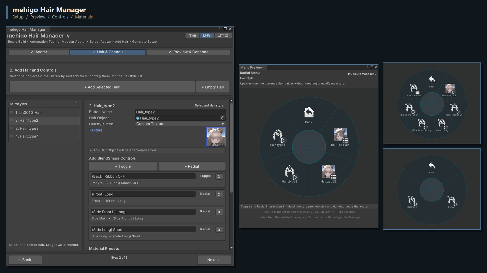

# mehigo Hair Manager — เครื่องมือ Automation สำหรับ Modular Avatar ที่พัฒนาโดยชุมชน

[English](README.md) | **ภาษาไทย**

**Version 1.3.0**

## ติดตั้งด้วย VCC

Repository URL:

`https://mehigosleep.github.io/mehigo-hair-manager/vpm.json`

## สร้างระบบควบคุมทรงผม VRChat อัตโนมัติด้วย Modular Avatar

**mehigo Hair Manager** เป็นเครื่องมือ Unity Editor Automation ที่พัฒนาโดยชุมชนและสร้างมาเพื่อใช้กับ [Modular Avatar](https://modular-avatar.nadena.dev/) ระบบจะสร้าง Animator Controller และ Layers, Animation Clips, Expression Menu, Parameters, Material Swap controls และ Component ของ Modular Avatar ที่จำเป็นสำหรับเชื่อมระบบเข้ากับ VRChat Avatar

Simple Build จะแนะนำผู้ใช้ตั้งแต่เลือก Avatar, เพิ่มทรงผม, สร้าง Toggle และ Radial สำหรับ BlendShape, ตั้งค่า Hair Material Presets, ตรวจ Menu Preview, ตรวจ Conflict ไปจนถึง Generate Setup ที่สมบูรณ์ Material Preset มีหน้าที่สลับ Material Assets ที่มีอยู่ใน Renderer slots เท่านั้น เครื่องมือไม่ได้สร้าง Material ใหม่หรือแก้สีภายใน Material

> **เป็นระบบสลับ Material เท่านั้น:** ผู้ใช้ต้องเตรียม Material แต่ละแบบใน Unity ไว้ก่อน mehigo Hair Manager จะสร้าง VRChat Menu และ Animation สำหรับสลับ Material เหล่านั้น รวมถึงปุ่ม Default สำหรับคืนค่า Material ชุดเดิม

Modular Avatar เป็น Core Dependency ที่จำเป็นและทำหน้าที่ non-destructive integration ตอน Build ส่วน mehigo Hair Manager จะสร้าง Control Assets และตั้งค่า Integration Components ให้อัตโนมัติ โดยไม่ได้มาแทนที่ Modular Avatar แต่ละ Avatar จะมี Output Folder แยกจากกัน จึงสามารถจัดการ Avatar หลายตัวหรือ Instance ที่ Copy มาได้โดยไม่เขียนทับไฟล์ของกันและกัน

> **โปรเจกต์ชุมชน:** โปรเจกต์นี้ไม่ใช่โปรเจกต์ทางการของ Modular Avatar และไม่มีความเกี่ยวข้องหรือได้รับการรับรองจาก bd_ หรือผู้พัฒนา Modular Avatar

Version 1.3.0 ใช้ Simple Build เป็น Workflow เดียว หน้า Hair & Controls แยกรายการทรงผมกับรายละเอียดของทรงที่เลือก มี Scroll แยก ลากเรียงลำดับ และลาก Hair Object จาก Hierarchy ลงรายการได้โดยตรง ส่วนการแก้ Activation detection, Linked Objects และ Conflict Review ยังคงอยู่ภายใน Workflow นี้

[Changelog](https://github.com/mehigosleep/mehigo-hair-manager/blob/main/CHANGELOG.md)

## ภาพรวม

### Simple Build และ Menu Preview แบบ Real-time

## ความสามารถ

- Simple Build แยกการทำงานเป็นหน้า Avatar → Hair & Controls → Preview & Generate
- หน้า Hair & Controls แบบรายการซ้ายและรายละเอียดทรงที่เลือกด้านขวา พร้อม Scroll แยก
- เพิ่ม Hair Objects หลายชิ้นจาก Selection ใน Hierarchy หรือลากลงในรายการทรงผมโดยตรง
- สร้างปุ่ม Toggle / Radial ได้รวดเร็วโดยไม่ต้องเลือก Renderer ก่อน
- ตั้งค่า Hair Material Preset ในคลิกเดียว พร้อม Scan Default Materials อัตโนมัติ
- สลับ Material Assets ที่มีอยู่ตาม Renderer slot และคืนค่า Material ชุด Default เดิมโดยอัตโนมัติ
- มี Default Icons สำหรับ Hair Menu, ทรงผม, BlendShape controls และ Material Presets
- เลือกไอคอนทรงผมแบบ Default, Project Texture หรือ Scene Capture ใน Simple Build
- สร้างเมนูเลือกทรงผมหลายแบบ
- ใช้งานผ่าน Modular Avatar Merge Animator / Parameters / Menu Installer
- ตั้งค่า Linked Objects แยกตามทรงผม
- BlendShape Toggle controls
- BlendShape Radial Puppet controls
- Hair Material Presets
- Custom Icons และ Scene View icon capture
- Menu Preview แบบ Radial และ Real-time ระหว่างแก้ Hair Styles พร้อมโหลด Gesture Manager UI assets อัตโนมัติเมื่อติดตั้งไว้
- ตัวเลือก Compatibility สำหรับ Hair Animator / Wrapper ที่มีอยู่
- Conflict Scanner ในหน้า Generate
- ตรวจสอบ Compatibility กับ Avatar Optimizer (AAO)
- Editor UI ภาษาไทย / English / 日本語
- บันทึก Config เพื่อกลับมาแก้ไข Setup ได้
- แยก Generated Output ตาม Avatar เพื่อป้องกันไฟล์ของแต่ละ Avatar เขียนทับกัน

## การ Optimize Animator

ตั้งแต่ Version 1.1.0 ระบบบังคับใช้ Standard Animator Layout ที่เสถียรสำหรับ BlendShape controls ที่ Generate ทั้งหมด โดยซ่อนแท็บ Performance และโหมด Optimize แบบทดลองไว้ชั่วคราว

Avatar Optimizer (AAO) ยังสามารถ Optimize Standard Controller ที่ Generate ได้ภายหลังใน Avatar Build Pipeline

โหมดทดลอง mehigo Direct BlendTree optimization ยังคงปิดอยู่ เนื่องจากการทดสอบกับ Avatar พบปัญหา BlendShape/Radial บางรูปแบบส่งผลข้ามกัน

## สิ่งที่ต้องมี

- Unity Project ที่ตั้งค่าสำหรับ VRChat Avatars
- VRChat Avatars SDK `>=3.10.4 <3.11.0`
- Modular Avatar `>=1.14.0 <2.0.0-a`

ตัวเลือกเสริม:

- Avatar Optimizer (AAO)
- Gesture Manager สำหรับ UI assets แบบ Radial Menu ที่คุ้นเคยใน Menu Preview โดยไม่ได้ bundle มากับ mehigo

v1.1.0 ทดสอบกับ VRChat SDK 3.10.4 ควรทดสอบ Avatar ใหม่ทุกครั้งหลังเปลี่ยน SDK หรือ Package Version

## ติดตั้งด้วย VCC

1. เพิ่ม Modular Avatar Repository เข้า VCC หากยังไม่ได้ติดตั้ง: `https://vpm.nadena.dev/vpm.json`
2. เพิ่ม mehigo Repository เข้า VCC: `https://mehigosleep.github.io/mehigo-hair-manager/vpm.json`
3. เปิด Avatar Project ใน VCC แล้วเพิ่ม **mehigo Hair Manager**
4. เปิด Unity และเลือก **Tools > mehigo > Hair Manager**

## ติดตั้งด้วยตนเอง

1. คัดลอกโฟลเดอร์ `Editor` ทั้งชุดของ Package รวมถึง `MehigoHairManager.cs` และ `Icons` ไปไว้ในโฟลเดอร์ `Assets` ของ Unity Project
2. ตรวจสอบว่าติดตั้ง Modular Avatar แล้ว
3. เปิด Unity
4. เลือก **Tools > mehigo > Hair Manager**

ห้ามติดตั้งเครื่องมือผ่าน VCC และวิธี Manual พร้อมกันใน Project เดียว และต้องลบสคริปต์ mehigo Hair Generator รุ่นเก่าที่ประกาศ Class ชื่อเดียวกันออก ไม่เช่นนั้น Unity อาจแจ้ง Compilation Error จาก Class ซ้ำ

## ขั้นตอนใช้งานพื้นฐาน

1. เปิด Hair Manager ระบบจะเข้าสู่ **Simple Build** โดยตรง
2. หน้า **Avatar** เลือก Avatar แล้วไปที่ **Hair & Controls**
3. เพิ่ม Hair Objects เลือกทรงจากรายการ แล้วเพิ่ม Toggle/Radial สำหรับ BlendShape หรือ **Material Preset** ตามต้องการ
4. ใช้ **แก้การตรวจจับ / ตัวเลือกเพิ่มเติม** ภายในทรงที่เลือกเมื่อต้องแก้ Activation หรือ Linked Objects
5. ไปที่ **Preview & Generate** ตรวจ Menu Preview และ Conflict Scanner แล้วกด **Generate / Update Setup**
6. ทดสอบ Menu และ Animation ที่ Generate ก่อน Upload Avatar

**Save Folder** เป็นโฟลเดอร์ฐานร่วม mehigo จะสร้างโฟลเดอร์ย่อย `Avatar_<id>` ที่คงที่สำหรับ Avatar แต่ละ Instance ใน Scene โดยอัตโนมัติ แม้จะ Copy Instance จาก Prefab เดียวกัน ไฟล์ Controller, Animation Clips, Expression Menus และ Captured Icons ก็จะไม่เขียนทับกัน ส่วน Prefab Asset ที่เปิดโดยตรงจะใช้ Asset GUID เป็นตัวระบุ

## สิ่งที่ระบบสร้าง

mehigo Hair Manager จะสร้างหรืออัปเดต Animator Controller และ Layers, Animation Clips, Expression Menu, Parameters, Icons, Config Assets และ Component ของ Modular Avatar ที่จำเป็น จากนั้น Modular Avatar จะใช้ Generated Setup นี้ทำ non-destructive merge ตอน Build โดย Generated Runtime Assets จะอยู่ในโฟลเดอร์ `Avatar_<id>` ของ Avatar แต่ละตัว การกด Generate/Update ซ้ำบน Avatar เดิมจะอัปเดตเฉพาะไฟล์ของ Avatar นั้น ส่วน Avatar อื่นจะได้รับ Output Folder แยก

ไม่ควรแก้ Generated Assets ด้วยตนเอง เว้นแต่เข้าใจว่าการ Generate/Update ครั้งถัดไปบน Avatar เดิมอาจเขียนทับการแก้ไขดังกล่าว ส่วน Assets จากเวอร์ชันเก่าที่อยู่ตรง Base Save Folder จะไม่ถูกลบโดยอัตโนมัติ

## เครดิต Modular Avatar

เครื่องมือนี้สร้างมาเพื่อใช้งานร่วมกับ [Modular Avatar](https://modular-avatar.nadena.dev/) ซึ่งพัฒนาโดย bd_ Modular Avatar เป็น Core Dependency ที่จำเป็นและเผยแพร่ภายใต้ [MIT License](https://github.com/bdunderscore/modular-avatar/blob/main/COPYING.md) สามารถดู [Source Repository ทางการ](https://github.com/bdunderscore/modular-avatar) ได้ที่นี่

โปรเจกต์ชุมชนนี้ไม่ใช่โปรเจกต์ทางการของ Modular Avatar และไม่มีความเกี่ยวข้องหรือได้รับการรับรองจาก bd_ หรือผู้พัฒนา Modular Avatar ภายใน Package ไม่มีการใช้โลโก้หรือ Restricted Image Assets ของ Modular Avatar

## การเชื่อมต่อกับ Gesture Manager แบบตัวเลือกเสริม

เมื่อติดตั้ง [Gesture Manager](https://github.com/BlackStartx/VRC-Gesture-Manager) ไว้ mehigo Hair Manager สามารถโหลด UI assets จาก Package ที่ผู้ใช้ติดตั้ง เพื่อแสดงหน้าตา Radial Menu ที่คุ้นเคยใน Menu Preview ซึ่งทำงานเฉพาะใน Editor โดย Gesture Manager เป็นตัวเลือกเสริม ไม่ได้ bundle มากับ mehigo Hair Manager และไม่มีผลต่อ Generated Avatar Setup หากไม่ได้ติดตั้ง ระบบจะใช้ Preview UI สำรองของ mehigo

Gesture Manager UI assets © 2019–2023 BlackStartx และเผยแพร่ภายใต้ [MIT License](https://github.com/BlackStartx/VRC-Gesture-Manager/blob/master/LICENSE.md) mehigo Hair Manager เป็นโปรเจกต์อิสระและไม่มีความเกี่ยวข้องหรือได้รับการรับรองจาก Gesture Manager หรือผู้พัฒนา

ดูเครดิต Dependency และ Optional Integration ทั้งหมดได้ใน [Third-Party Notices](THIRD_PARTY_NOTICES.md)

## สัญญาอนุญาต

Copyright (c) 2026 mehigosleep. All rights reserved. ดูรายละเอียดใน [LICENSE.md](https://github.com/mehigosleep/mehigo-hair-manager/blob/main/LICENSE.md) และ [THIRD_PARTY_NOTICES.md](https://github.com/mehigosleep/mehigo-hair-manager/blob/main/THIRD_PARTY_NOTICES.md)
