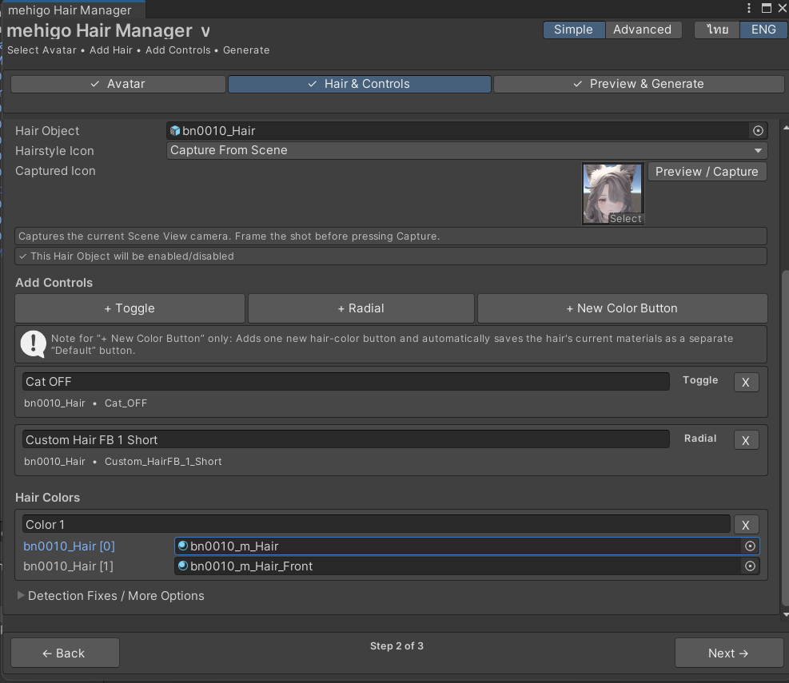
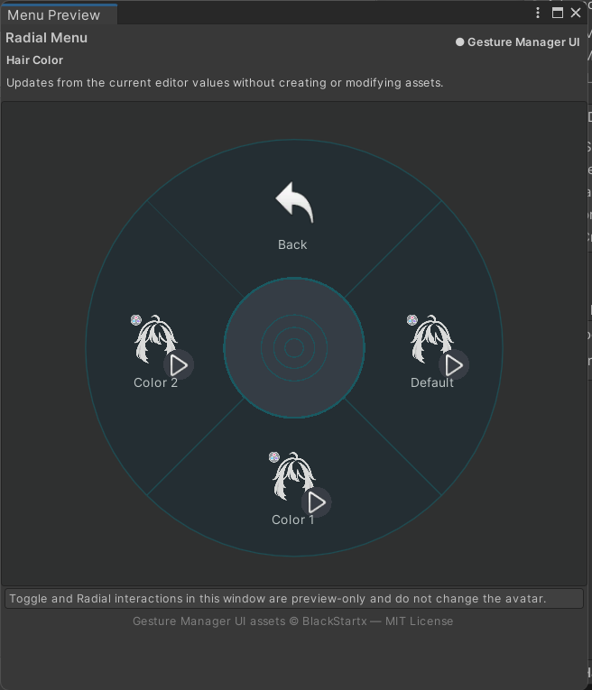

# Simple Modeガイド — mehigo Hair Manager 1.2.0

[English](SIMPLE_MODE_GUIDE_EN.md) · [ภาษาไทย](SIMPLE_MODE_GUIDE_TH.md) · [プロジェクトページ](../README.md)

> このガイドでは、バージョン1.2.0の**Simple Mode**を使って、VRChatアバターの髪型切り替えメニュー、BlendShapeコントロール、髪色プリセットを作成し、プレビュー後にセットアップを生成する手順を説明します。

## 必要な環境

- Unity 2022.3のVRChat Avatarsプロジェクト
- VRChat Avatars SDK `>=3.10.4 <3.11.0`
- Modular Avatar `>=1.14.0 <2.0.0-a`
- **VRC Avatar Descriptor**が設定されたアバター
- 選択するHair ObjectがアバターのHierarchy内に配置されていること

Gesture Managerは任意です。インストール済みの場合、Menu PreviewでGesture Managerと同じUI素材を利用できます。

## Simple Modeの流れ

1. **Avatar** — アバターを選択
2. **Hair & Controls** — 髪型、BlendShape、髪色を追加
3. **Preview & Generate** — メニューを確認してセットアップを生成

Avatar Descriptor、Hair RootまたはWrapper、Renderer、BlendShape、Material、出力フォルダは自動検出されます。Parameter名やAnimator Layer、生成ファイル名を手動で設定する必要はありません。

## 1. Hair Managerを開く

Unityのメニューから **Tools > mehigo > Hair Manager** を選択します。

右上で **Simple** を選びます。**ไทย / ENG**はいつでも切り替えられ、設定中のデータには影響しません。

## 2. Avatarページ

アバターが未選択の場合、**Avatar**欄は空で、**Next**ボタンは無効です。

Hierarchyからアバターのルートを**Avatar**欄にドラッグするか、右端のObject Pickerから選択します。VRC Avatar Descriptorが見つかると**Ready**と表示され、次のページへ進めます。

### Menu Options

- **Menu Name** — VRChatに表示されるルートメニュー名。初期値は`Hair Style`です。
- **Remember Selected Hair** — ユーザーが選択した髪型を保存します。

### Load Existing Setup for This Avatar

以前このアバターで生成したセットアップを編集する場合に使用します。保存済みConfigから髪型やコントロールを読み戻します。

## 3. Hair & Controlsページ

髪型は次の3通りで追加できます。

- Hierarchyで1個または複数のHair Objectを選択し、**+ Add Selected Hair**を押す
- **Drop Hair Objects Here**へドラッグ＆ドロップする
- **+ Empty Hair**を押し、Hair Objectを後から指定する

Hair Objectは選択中のアバター配下に置く必要があります。ボタン名、Material、髪型の表示切り替え方法は自動で準備されます。

## 4. Hair Cardを設定する

Hair Cardでは次の内容を編集できます。

- **Button Name** — メニューに表示する髪型名
- **Hair Object** — 髪型のルートObject
- **Hairstyle Icon** — 髪型ボタンのアイコン
- 自動検出された表示切り替え方法
- Toggle、Radial、髪色ボタン
- `▲` / `▼`で順番変更、`X`でセットアップから削除

`X`を押してもHierarchy内の元のGameObjectは削除されません。

## 5. 髪型アイコンを選ぶ

**Hairstyle Icon**には3つのモードがあります。

- **Default** — mehigo Hair Manager付属の髪型アイコンを使用
- **Custom Texture** — Project内のTexture2Dを選択
- **Capture From Scene** — 現在のScene Viewから256 × 256のアイコンを作成

Scene Captureを使う場合は、Scene Viewで構図を決め、**Preview / Capture**を開きます。角度を変えた後は**Refresh Preview**、確定時は**Capture & Use**を押します。

撮影したアイコンはアバター専用の出力フォルダに保存されるため、別アバターのアイコンを上書きしません。

## 6. ToggleとRadialを追加する

### Toggle

**+ Toggle**を押してBlendShapeを選択します。ON/OFFの2状態を切り替える機能に適しています。

### Radial

**+ Radial**を押してBlendShapeを選択します。0〜100の連続値を調整する機能に適しています。

RendererとBlendShapeはHair Object配下から自動で一覧化されます。

追加後はボタン名を編集できます。各項目には**Toggle**または**Radial**の種類と、元のRenderer・BlendShape名が表示されます。

## 7. 髪色ボタンを追加する

**+ New Color Button**を押すと、髪色ボタンが1個追加されます。

> 髪色ボタンを初めて追加した時点で、現在のMaterialは自動的に別の**Default**ボタンとして保存されます。

**Hair Colors**でボタン名を`Pink`、`White`、`Black`などに変更し、色を変えたいRenderer/Material Slotだけ新しいMaterialへ差し替えます。

DefaultはHair Card内の編集欄には表示されませんが、Menu Previewと生成後のHair Colorサブメニューには独立したボタンとして表示されます。

## 8. 複数の髪型を管理する

Hair Cardは複数追加できます。1枚を開くと他のCardは自動で閉じるため、画面が長くなりすぎません。`▲`と`▼`でメニューの表示順を変更できます。

髪型ごとに異なるアイコン、Toggle、Radial、髪色プリセットを設定できます。

### Detection Fixes / More Options

通常は閉じたままで問題ありません。自動検出されたWrapperや表示切り替えが髪型Prefabに合わない場合に開き、Hair Objectの直接制御、Existing Wrapper、他システムによる制御、髪型と一緒に表示するアクセサリーなどを設定します。

## 9. Preview & Generateページ

設定が完了したら**Next**で3ページ目へ進みます。髪型、コントロール、髪色の数が表示されます。

必要な情報が不足している場合はGenerateが無効になり、問題箇所と修正ボタンが表示されます。

## 10. Menu Previewを確認する

**Open Menu Preview**を押すと、Assetを生成・変更せずに現在のメニュー構造を確認できます。

### ルートメニュー

Hair Cardの順番で全髪型が表示されます。

### 髪型サブメニュー

髪型を選ぶと、髪型使用ボタン、Toggle、Radial、Hair Colorサブメニューが表示されます。

Preview内の操作はSceneのアバターを変更しません。ボタン数が1ページを超えると、ページ切り替えボタンが自動で追加されます。

### Hair Colorサブメニュー

**Default**と追加したすべての髪色が表示されます。各Presetには同じHair Color用デフォルトアイコンが使用されます。

## 11. セットアップを生成・更新する

Preview確認後、**Generate / Update Setup**を押します。ツールは次の処理を行います。

1. 入力内容とConflictを確認
2. Animator ControllerとAnimation Clipsを生成・更新
3. Expressions MenuとParametersを生成
4. アバター配下に`mehigo Hair Selector`を作成
5. Modular Avatar Merge Animator、Parameters、Menu Installerを設定
6. 編集用Configを保存

生成ファイルはアバターごとの`Avatar_<id>`フォルダに保存されます。同じアバターで再生成するとそのアバターのファイルだけを更新し、別アバターのファイルは上書きしません。

## 12. 既存セットアップを編集する

1. Hair Managerを開く
2. 元のアバターを選択
3. **Load Existing Setup for This Avatar**を押す
4. Hair Card、コントロール、髪色を編集
5. Menu Previewで確認
6. **Generate / Update Setup**を押す

生成済みのAnimator、Animation、Menuを直接編集すると、次回のUpdateで上書きされる場合があります。

## アップロード前の確認

- すべての髪型が正しく表示・非表示になる
- ToggleとRadialが指定した髪のBlendShapeだけを動かす
- Defaultで元のMaterialに戻る
- 各髪色が正しいMaterial Slotを使用している
- Menu Previewのボタンと順番が正しい
- Build/Upload前にPlay Modeまたはテストツールで動作確認する

