# Simple Build ガイド — mehigo Hair Manager 1.3.0

[English](SIMPLE_MODE_GUIDE_EN.md) · [ภาษาไทย](SIMPLE_MODE_GUIDE_TH.md) · [プロジェクトページ](../README.md)

> このガイドでは、バージョン1.3.0の**Simple Build**を使って、VRChatアバターの髪型切り替えメニュー、ブレンドシェイプコントロール、髪のマテリアルプリセットを作成し、プレビュー後にセットアップを生成する手順を説明します。

> **mehigo Hair Manager は[Modular Avatar](https://modular-avatar.nadena.dev/)向けのコミュニティ製自動化ツールです。** アニメーターコントローラーとレイヤー、アニメーションクリップ、Expression Menu、パラメーター、マテリアル切り替えコントロール、必要な Modular Avatar コンポーネントを生成します。Modular Avatar は必須のコア依存関係であり、非破壊な統合をビルド時に実行します。本プロジェクトはModular Avatarの公式プロジェクトではなく、開発者との提携・推奨を示すものではありません。

## 必要な環境

- Unity 2022.3のVRChat Avatarsプロジェクト
- VRChat Avatars SDK 推奨バージョン: `3.10.4`
- Modular Avatar 推奨バージョン: `1.14.0`
- **VRC Avatar Descriptor**が設定されたアバター
- 選択する髪のゲームオブジェクトがアバターのゲームオブジェクト配下に配置されていること

[Gesture Manager](https://github.com/BlackStartx/VRC-Gesture-Manager)は任意です。インストール済みの場合、メニュープレビューはユーザーがインストールしたパッケージからUIアセットを読み込めます。Gesture Manager はmehigo Hair Managerに同梱されず、生成されるアバターアセットにも影響しません。Gesture Manager UI assets © 2019–2023 BlackStartx — [MIT License](https://github.com/BlackStartx/VRC-Gesture-Manager/blob/master/LICENSE.md)。

## Simple Build の流れ

1. **アバター** — アバターを選択
2. **髪とコントロール** — 髪型、ブレンドシェイプ、マテリアルプリセットを追加
3. **プレビューと生成** — メニューを確認してセットアップを生成

Avatar Descriptor、Hair Root または Wrapper、レンダラー、ブレンドシェイプ、マテリアル、出力フォルダを自動検出し、パラメーター、アニメーターコントローラーのレイヤー、必要なファイルを生成します。これらを手動で設定する必要はありません。

## 1. Hair Managerを開く

Unity のメニューから **Tools > mehigo > Hair Manager** を選択します。

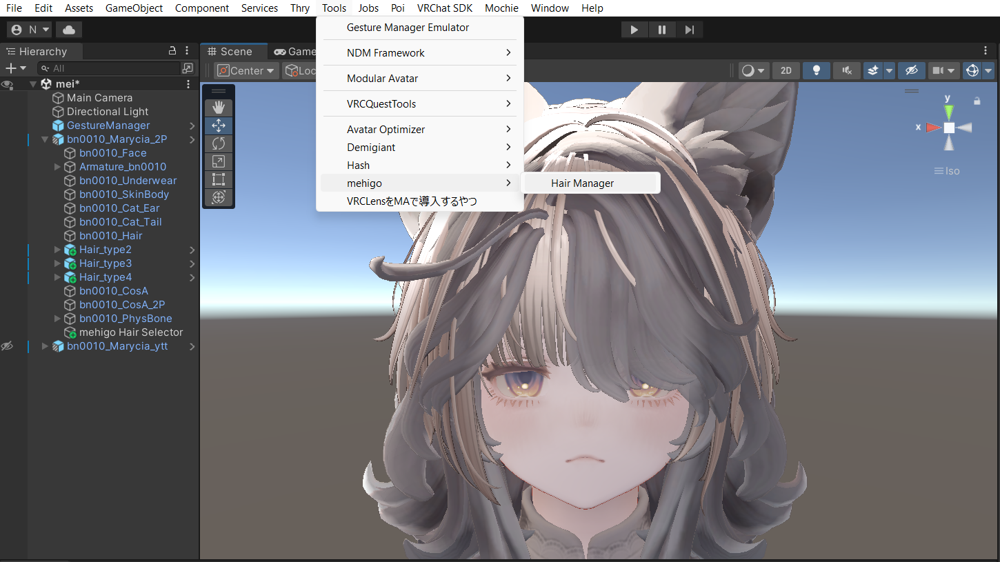

Hair Manager は **Simple Build** で直接開きます。**ไทย / ENG / 日本語**はいつでも切り替えられ、設定中のデータには影響しません。

## 2. アバターページ

アバターが未選択の場合、**アバター**欄は空で、**次へ**ボタンは無効です。

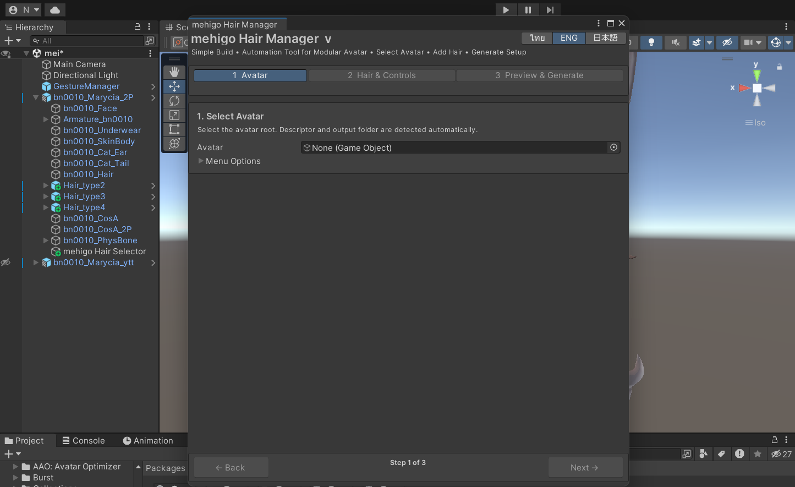

Hierarchy ウィンドウからアバターのルートを**アバター**欄にドラッグするか、右端のオブジェクトピッカーから選択します。VRC Avatar Descriptor が見つかると**Ready**と表示され、次のページへ進めます。

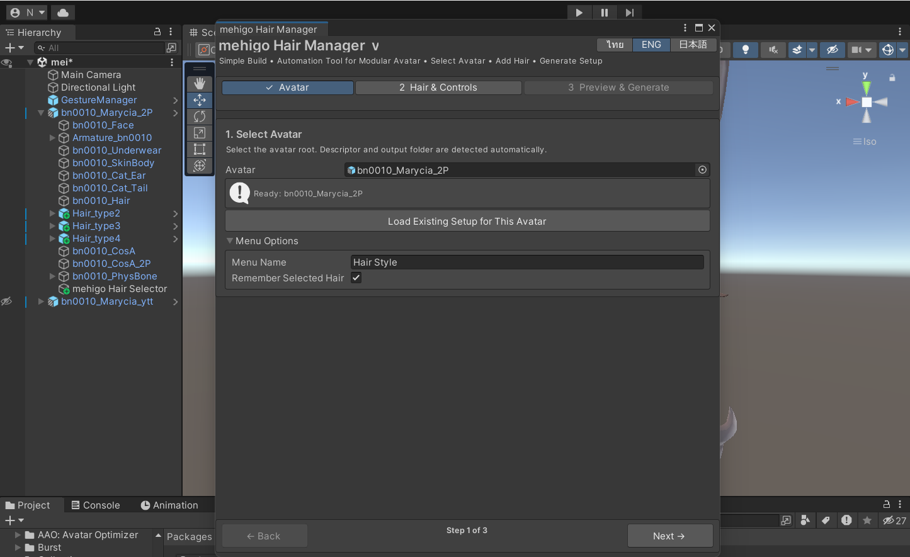

### メニューオプション

- **メニュー名** — VRChat に表示されるルートメニュー名。初期値は`Hair Style`です。
- **選択した髪を保存** — ユーザーが選択した髪型を保存します。

### このアバターの既存セットアップを読み込む

以前このアバターで生成したセットアップを編集する場合に使用します。保存済み設定ファイルから髪型やコントロールを読み戻します。

## 3. 髪とコントロールページ

左側に髪型リスト、右側に選択中の髪型エディターが表示され、それぞれ個別にスクロールできます。髪型は次の3通りで追加できます。

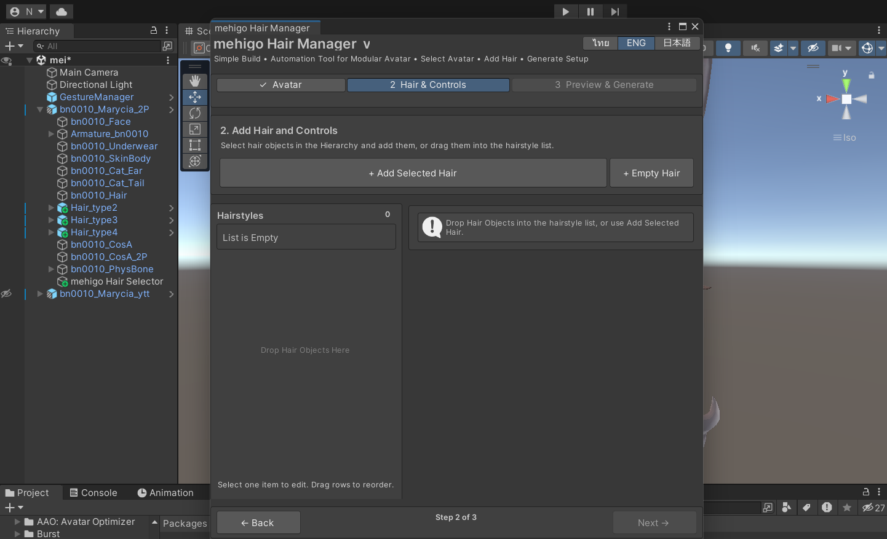

- Hierarchy ウィンドウで1つまたは複数の髪のゲームオブジェクトを選択し、**+ 選択した髪を追加**を押す
- 1つまたは複数の髪のゲームオブジェクトを**髪型リスト**へ直接ドラッグ＆ドロップする
- **+ 空の髪を追加**を押し、髪のゲームオブジェクトを後から指定する

髪のゲームオブジェクトは選択中のアバター配下に置く必要があります。ボタン名、マテリアル、髪型の表示切り替え方法は自動で準備されます。

## 4. 選択中の髪型を設定する

**髪型リスト**の行をクリックすると、右側で次の内容を編集できます。

- **ボタン名** — メニューに表示する髪型名
- **髪のゲームオブジェクト** — 髪型のルートゲームオブジェクト
- **ヘアスタイルアイコン** — 髪型ボタンのアイコン
- 自動検出された表示切り替え方法
- **BlendShape コントロールを追加**の Toggle / Radial ボタン
- 追加ボタンと説明をまとめた独立した**マテリアルプリセット**セクション

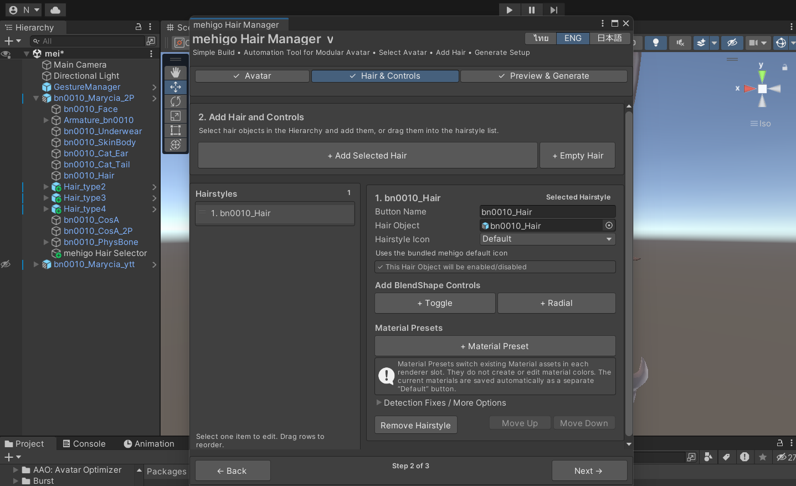

`X`を押してもHierarchy ウィンドウ内の元のゲームオブジェクトは削除されません。

## 5. 髪型アイコンを選ぶ

**ヘアスタイルアイコン**には3つのモードがあります。

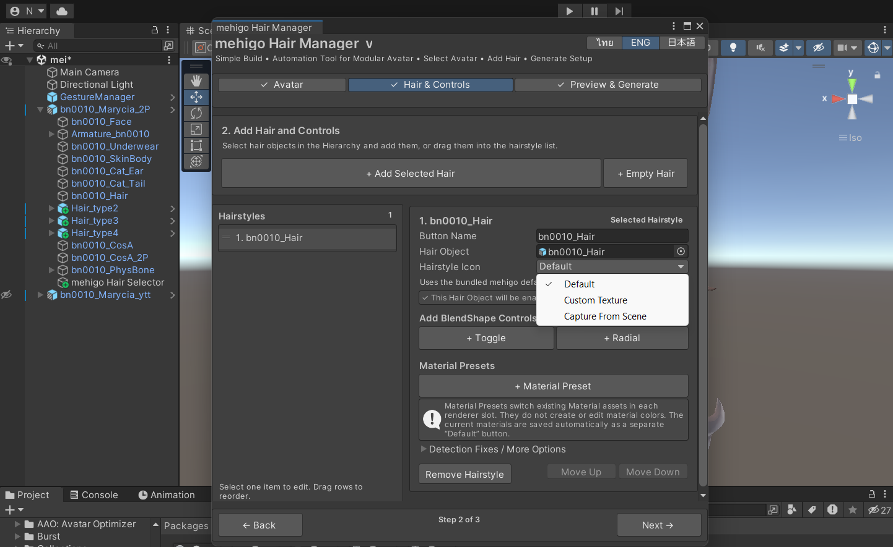

- **デフォルト** — mehigo Hair Manager付属の髪型アイコンを使用
- **カスタムテクスチャ** — Project ウィンドウ内のテクスチャ (Texture2D)を選択
- **シーンビューからキャプチャ** — 現在の Scene ビューから256 × 256のアイコンを作成

シーンキャプチャを使う場合は、Scene ビューで構図を決め、**プレビュー / キャプチャ**を開きます。角度を変えた後は**プレビューを更新**、確定時は**キャプチャして使用**を押します。

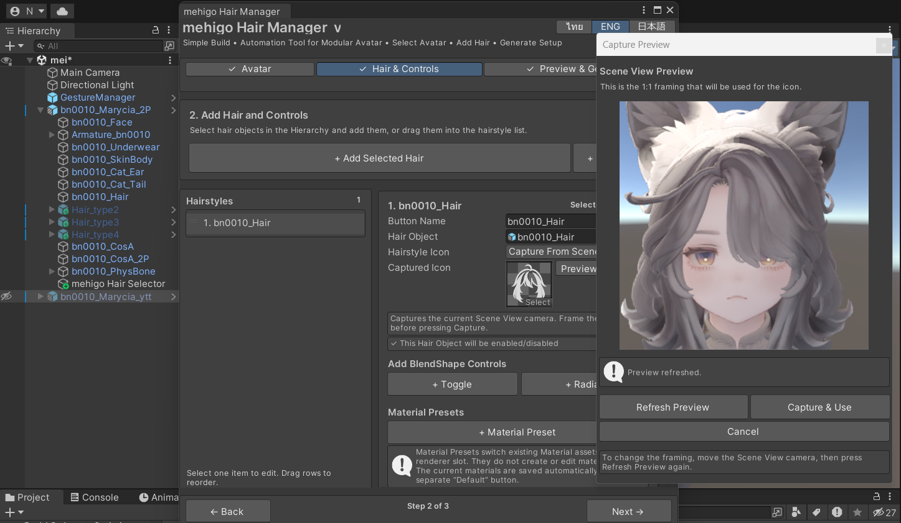

撮影したアイコンはアバター専用の出力フォルダに保存されるため、別のアバターのアイコンを上書きしません。

## 6. Toggle と Radialを追加する

### Toggle

**+ Toggle**を押してブレンドシェイプを選択します。ON / OFFの2状態を切り替える機能に適しています。

### Radial

**+ Radial**を押してブレンドシェイプを選択します。0〜100の連続値を調整する機能に適しています。

レンダラーとブレンドシェイプは髪のゲームオブジェクト配下から自動で一覧化されます。

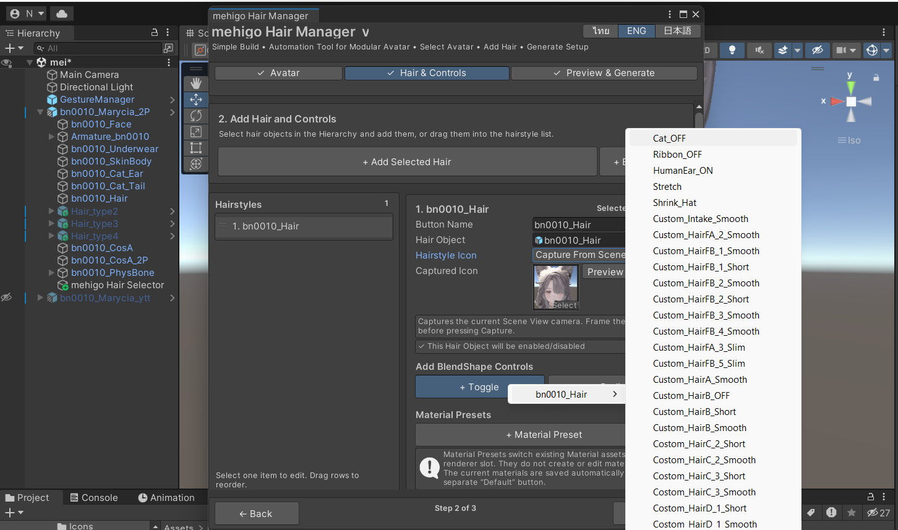

追加後はボタン名を編集できます。各項目には**Toggle**または**Radial**の種類と、元のレンダラー・ブレンドシェイプ名が表示されます。

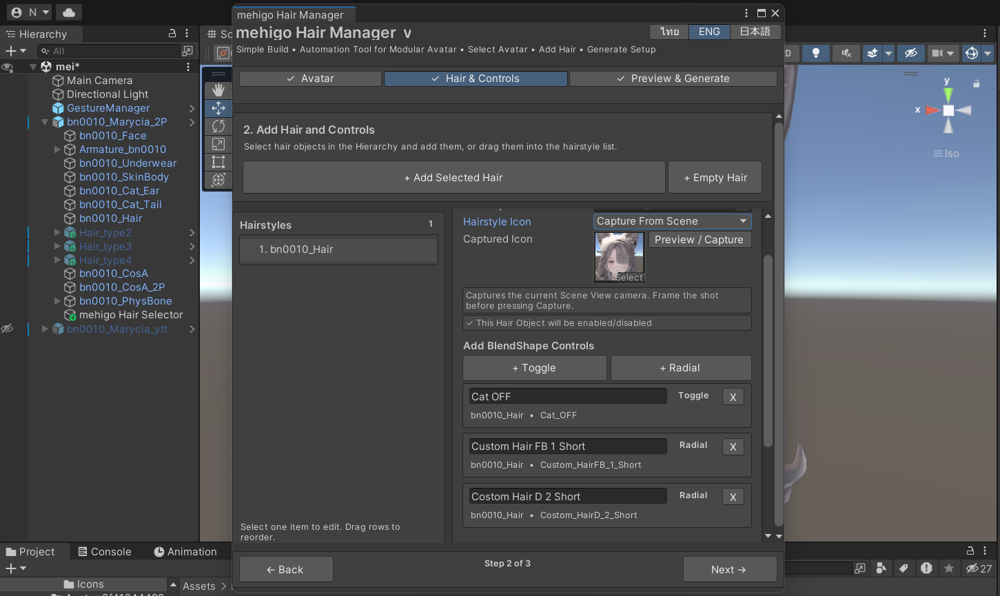

## 7. 髪のマテリアルプリセットを追加する

**+ マテリアルプリセット**を押すと、既存のマテリアルアセットを切り替えるボタンが1個追加されます。

> マテリアルプリセットはマテリアルを新規作成したり、シェーダーの色を編集したりする機能ではありません。レンダラーのマテリアルスロットへ割り当てるマテリアルアセットを切り替えます。現在のマテリアルは自動的に別の**デフォルト**ボタンとして保存されます。

**マテリアルプリセット**でボタン名を`Pink`、`White`、`Black`などに変更し、切り替えたいレンダラーのマテリアルスロットへ既存のマテリアルアセットを割り当てます。

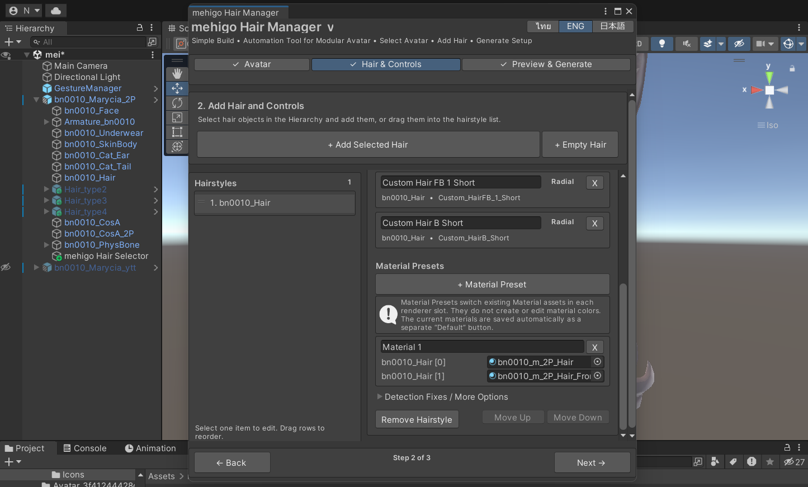

デフォルトは編集欄には表示されませんが、メニュープレビューと生成後の髪のマテリアルサブメニューには独立したボタンとして表示されます。

## 8. 複数の髪型を管理する

髪型は複数追加できます。行をクリックして編集対象を選び、行をドラッグしてメニューの表示順を変更します。髪型リストと右側のエディターは個別にスクロールでき、ページ全体は移動しません。

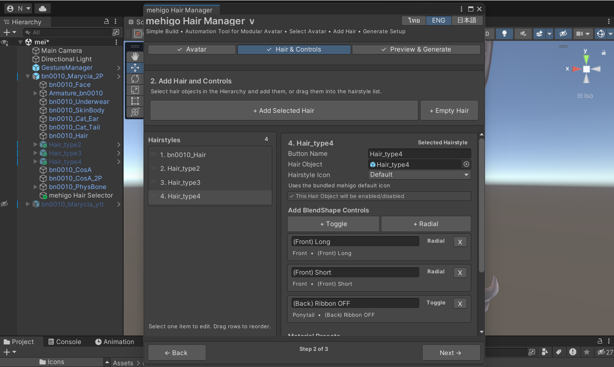

髪型ごとに異なるアイコン、Toggle、Radial、マテリアルプリセットを設定でき、選択中の髪型は右側のエディターに表示されます。

### 検出の修正 / その他のオプション

通常は閉じたままで問題ありません。自動検出された Wrapperや表示切り替えが髪型プレハブに合わない場合に開き、髪のゲームオブジェクトの直接制御、既存の Wrapper、他システムによる制御、髪型と一緒に表示するアクセサリーなどを設定します。

## 9. プレビューと生成ページ

設定が完了したら**次へ**で3ページ目へ進みます。髪型、コントロール、マテリアルプリセットの数が表示されます。

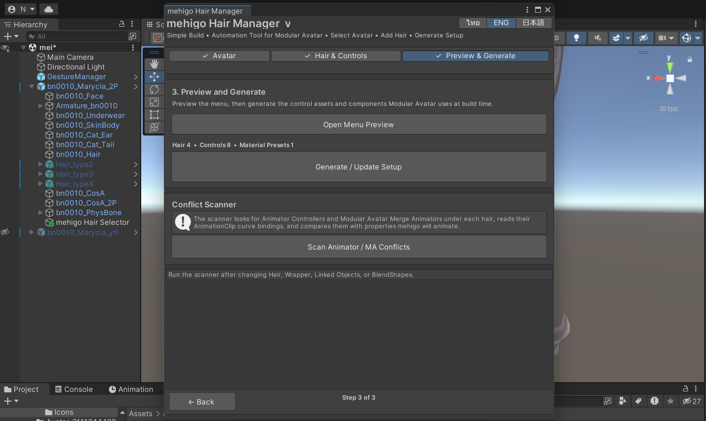

必要な情報が不足している場合は**生成**ボタンが無効になり、問題箇所と修正ボタンが表示されます。

## 10. メニュープレビューを確認する

**メニュープレビューを開く**を押すと、アセットを生成または変更せずに現在のメニュー構造を確認できます。

### ルートメニュー

髪型リストの順番で全髪型が表示されます。

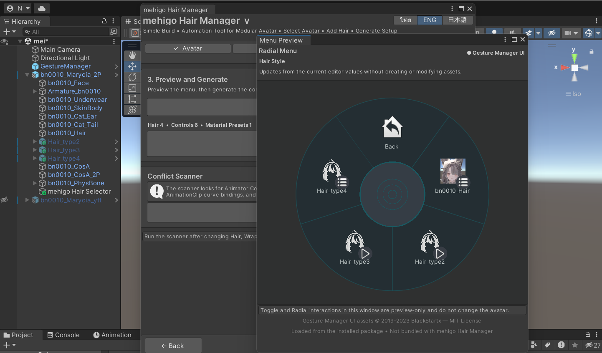

キャプチャまたは設定したカスタムアイコンはプレビューへすぐに反映されます。

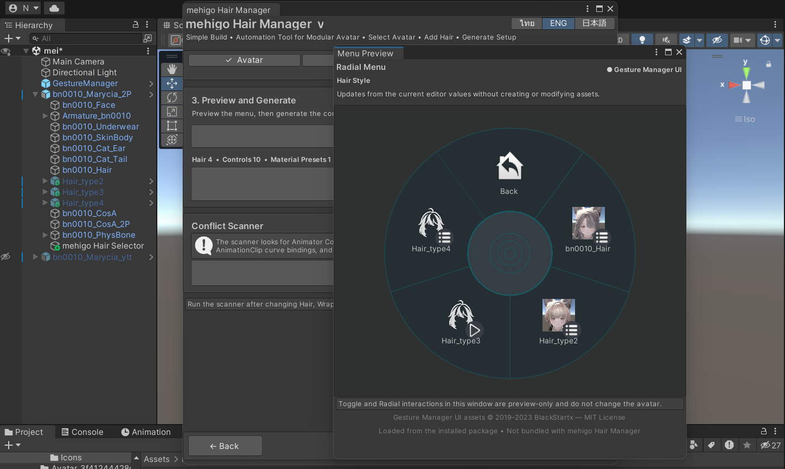

### 髪型サブメニュー

髪型を選ぶと、髪型使用ボタン、Toggle、Radial、髪のマテリアルサブメニューが表示されます。

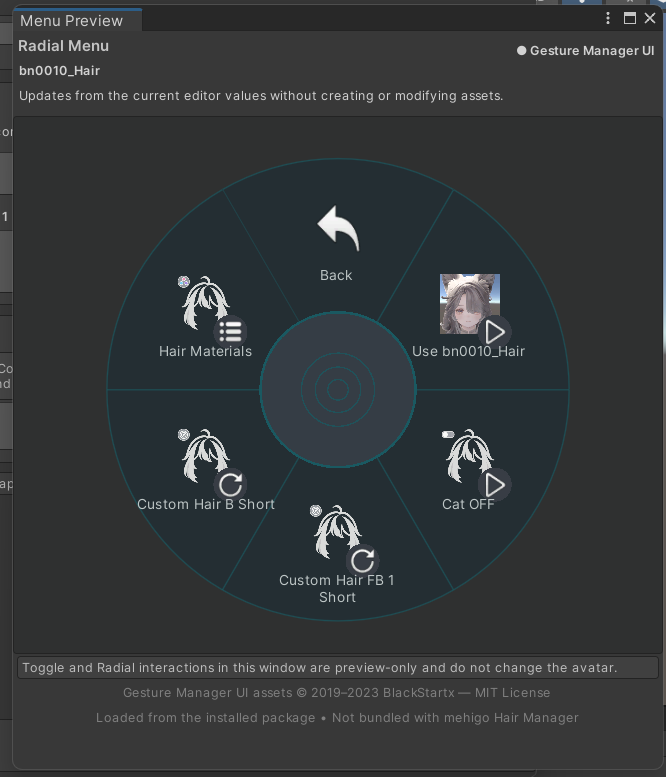

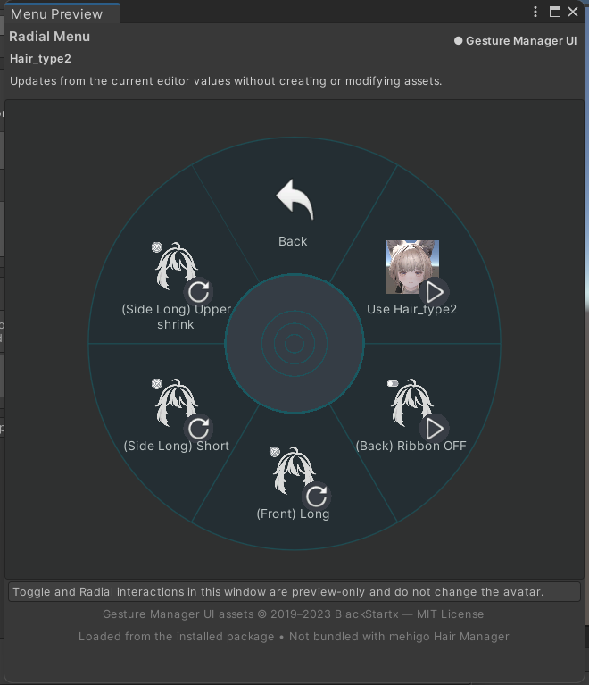

プレビュー内の操作はシーン内のアバターを変更しません。ボタン数が1ページを超えると、ページ切り替えボタンが自動で追加されます。

### 髪のマテリアルサブメニュー

**デフォルト**と追加したすべてのマテリアルプリセットが表示されます。ボタンを選択するとマテリアルアセットが切り替わり、色が生成されるわけではありません。各プリセットには同じマテリアルプリセット用デフォルトアイコンが使用されます。

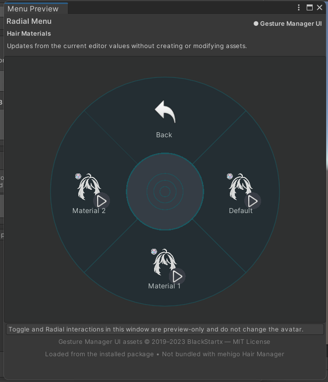

## 11. セットアップを生成・更新する

プレビュー確認後、**セットアップを生成 / 更新**を押します。mehigo Hair Manager は次の処理を行います。

1. 入力内容と競合を確認
2. アニメーターコントローラーとアニメーションクリップを生成・更新
3. Expressions Menu とパラメーターを生成
4. アバター配下に`mehigo Hair Selector`を作成
5. ビルド時に使用するModular Avatar Merge Animator、Modular Avatar Parameters、Menu Installer Componentを作成・設定
6. 編集用設定ファイルを保存

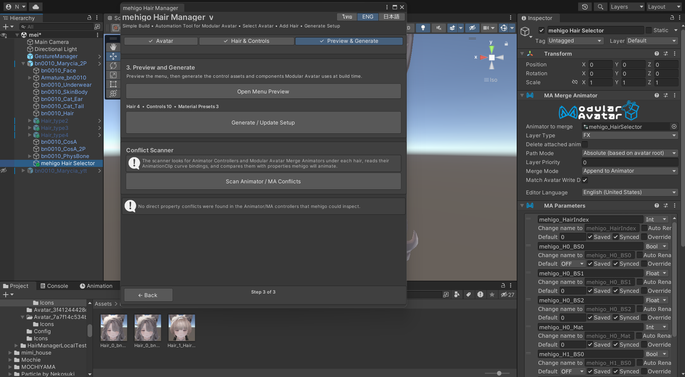

生成ファイルはアバターごとの`Avatar_<id>`フォルダに保存されます。同じアバターで再生成するとそのアバターのファイルだけを更新し、別のアバターのファイルは上書きしません。非破壊マージは引き続きModular Avatarがビルド時に実行します。

競合が検出された場合は生成を一時停止し、同じページの**競合スキャナー**に確認内容を表示します。

## 12. 既存セットアップを編集する

1. Hair Managerを開く
2. 元のアバターを選択
3. **このアバターの既存セットアップを読み込む**を押す
4. 髪型を選び、設定、コントロール、マテリアルプリセットを編集
5. メニュープレビューで確認
6. **セットアップを生成 / 更新**を押す

生成済みのアニメーターコントローラー、アニメーションクリップ、Expression Menuを直接編集すると、次回の更新時に上書きされる場合があります。

## アップロード前の確認

- すべての髪型が正しく表示・非表示になる
- Toggle と Radialが指定した髪のブレンドシェイプだけを動かす
- デフォルトで元のマテリアルに戻る
- 各マテリアルプリセットが正しいマテリアルアセットとスロットを使用している
- メニュープレビューのボタンと順番が正しい
- ビルド / アップロード前に再生モードまたはテストツールで動作確認する
