# คู่มือ Simple Mode — mehigo Hair Manager 1.2.0

[English](SIMPLE_MODE_GUIDE_EN.md) · [日本語](SIMPLE_MODE_GUIDE_JA.md) · [หน้าโครงการ](../README.md) · [คู่มือฉบับเต็ม](USER_GUIDE_TH.md)

> คู่มือนี้อธิบายเฉพาะ **Simple Mode** ของเวอร์ชัน 1.2.0 สำหรับการสร้างเมนูเลือกทรงผม เพิ่มปุ่ม BlendShape เพิ่ม Hair Material Preset ตรวจ Menu Preview และ Generate Setup

## สิ่งที่ต้องมี

- Unity 2022.3 และโปรเจกต์ VRChat Avatars
- VRChat Avatars SDK `>=3.10.4 <3.11.0`
- Modular Avatar `>=1.14.0 <2.0.0-a`
- Avatar ที่มี **VRC Avatar Descriptor**
- Hair Objects ต้องอยู่ใต้ Avatar ที่เลือกใน Hierarchy

Gesture Manager เป็นอุปกรณ์เสริม หากติดตั้งไว้ Menu Preview จะใช้หน้าตาและไอคอนแบบเดียวกับ Gesture Manager

## ภาพรวมการทำงาน

Simple Mode แบ่งงานออกเป็นสามหน้า:

1. **Avatar** — เลือก Avatar
2. **Hair & Controls** — เพิ่มทรงผม ปุ่ม BlendShape และ Material Preset
3. **Preview & Generate** — ตรวจเมนูแล้วสร้าง Setup

ระบบจะตรวจ Avatar Descriptor, Hair Root/Wrapper, Renderer, BlendShape, Material และ Output Folder ให้อัตโนมัติ ผู้ใช้ไม่จำเป็นต้องตั้ง Parameter, Animator Layer หรือชื่อไฟล์ที่ Generate เอง

## 1. เปิด Hair Manager

ใน Unity เลือก **Tools > mehigo > Hair Manager**

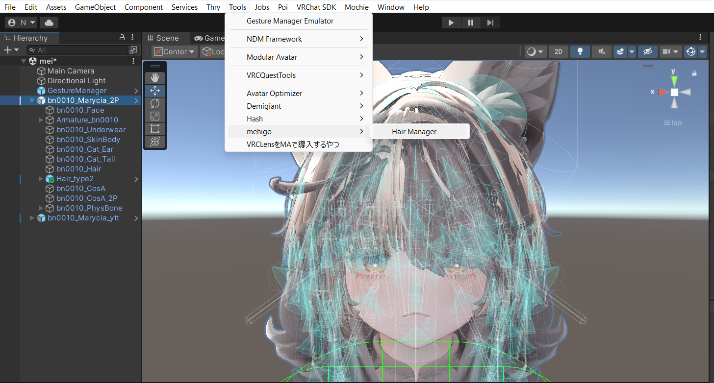

เลือก **Simple** ที่มุมขวาบน สามารถสลับภาษา **ไทย / ENG** ได้ตลอดเวลา การเปลี่ยนภาษาไม่กระทบข้อมูลที่ตั้งไว้

## 2. หน้า Avatar

เมื่อยังไม่ได้เลือก Avatar ช่อง **Avatar** จะว่างและปุ่ม **Next** จะยังใช้งานไม่ได้

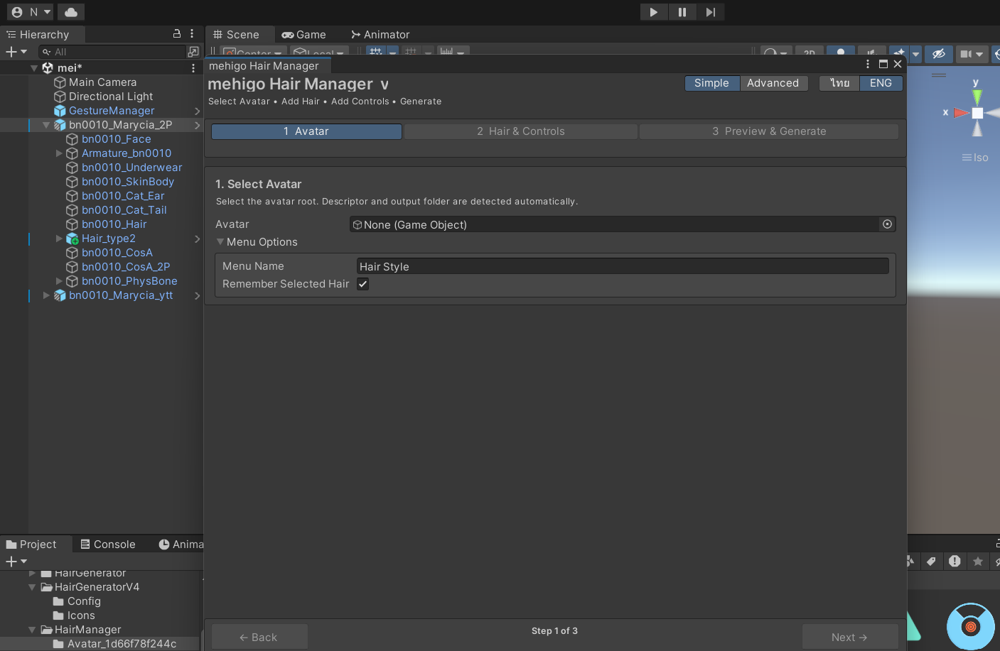

ลาก Avatar Root จาก Hierarchy ลงในช่อง **Avatar** หรือกดปุ่มวงกลมด้านขวาเพื่อเลือก Object ระบบจะค้นหา VRC Avatar Descriptor และเตรียม Output Folder ให้โดยอัตโนมัติ

เมื่อพบ Descriptor จะขึ้นสถานะ **Ready** และสามารถกด **Next** เพื่อไปหน้าถัดไปได้

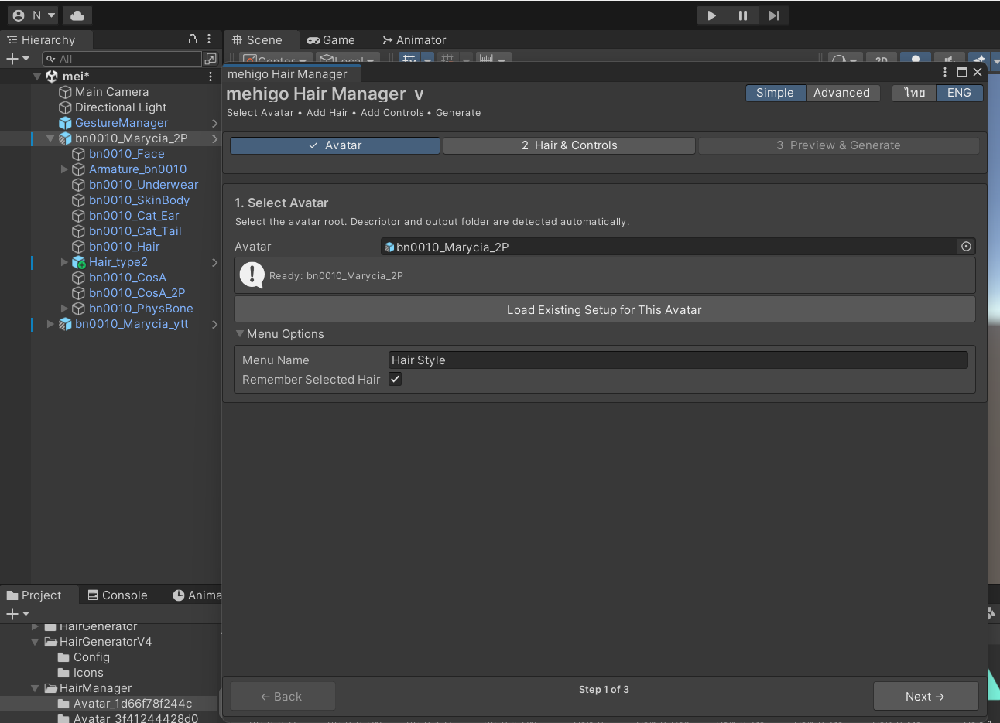

### Menu Options

- **Menu Name** — ชื่อเมนูหลักที่จะแสดงใน VRChat ค่าเริ่มต้นคือ `Hair Style`
- **Remember Selected Hair** — จำทรงผมที่ผู้ใช้เลือกไว้ระหว่างการใช้งาน Avatar

### Load Existing Setup for This Avatar

ใช้เมื่อต้องการแก้ไข Setup ที่เคย Generate จาก Avatar นี้ ระบบจะโหลด Config เดิมกลับมาโดยไม่ต้องเพิ่มทรงผมใหม่ทั้งหมด

> หากขึ้นข้อความว่าไม่พบ VRC Avatar Descriptor ให้เลือก GameObject รากของ Avatar แทนวัตถุลูก

## 3. หน้า Hair & Controls

หน้าเริ่มต้นจะแสดงสามวิธีสำหรับเพิ่มทรงผม

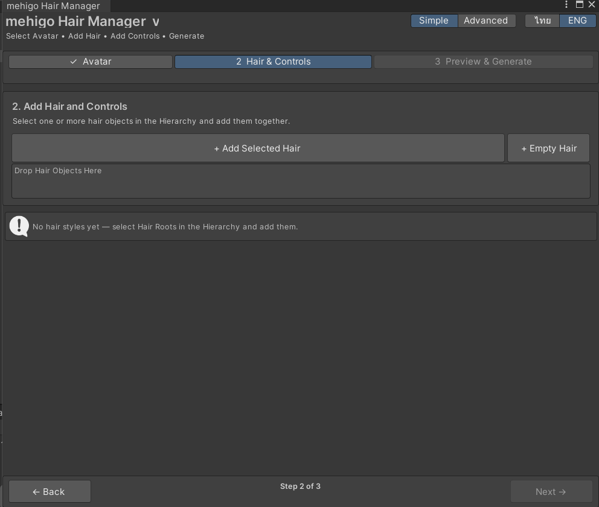

### วิธีเพิ่มทรงผม

- เลือก Hair Object หนึ่งชิ้นหรือหลายชิ้นใน Hierarchy แล้วกด **+ Add Selected Hair**
- ลาก Hair Objects มาวางในช่อง **Drop Hair Objects Here**
- กด **+ Empty Hair** แล้วกำหนด Hair Object เองภายหลัง

Hair Object ต้องอยู่ใต้ Avatar ที่เลือก ระบบจะตั้งชื่อปุ่มตามชื่อ Object, สแกน Material และตรวจวิธีเปิด–ปิดทรงผมให้อัตโนมัติ

## 4. ตั้งค่า Hair Card

Hair Card ที่เปิดอยู่ประกอบด้วย:

- **Button Name** — ชื่อปุ่มทรงผมในเมนู
- **Hair Object** — วัตถุรากของทรงผม
- **Hairstyle Icon** — ไอคอนของปุ่มทรงผม
- สถานะการตรวจจับการเปิด–ปิด Hair Object
- ปุ่มเพิ่ม Toggle, Radial และ Material Preset
- ปุ่ม `▲` / `▼` สำหรับเปลี่ยนลำดับ และ `X` สำหรับนำรายการออกจาก Setup

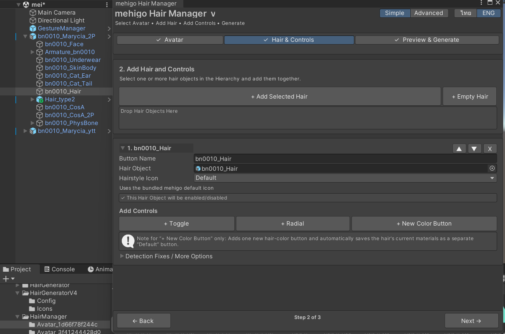

การกด `X` จะนำทรงผมออกจากรายการของเครื่องมือเท่านั้น ไม่ได้ลบ GameObject ต้นฉบับใน Hierarchy

## 5. เลือกไอคอนทรงผม

ช่อง **Hairstyle Icon** มีสามโหมด

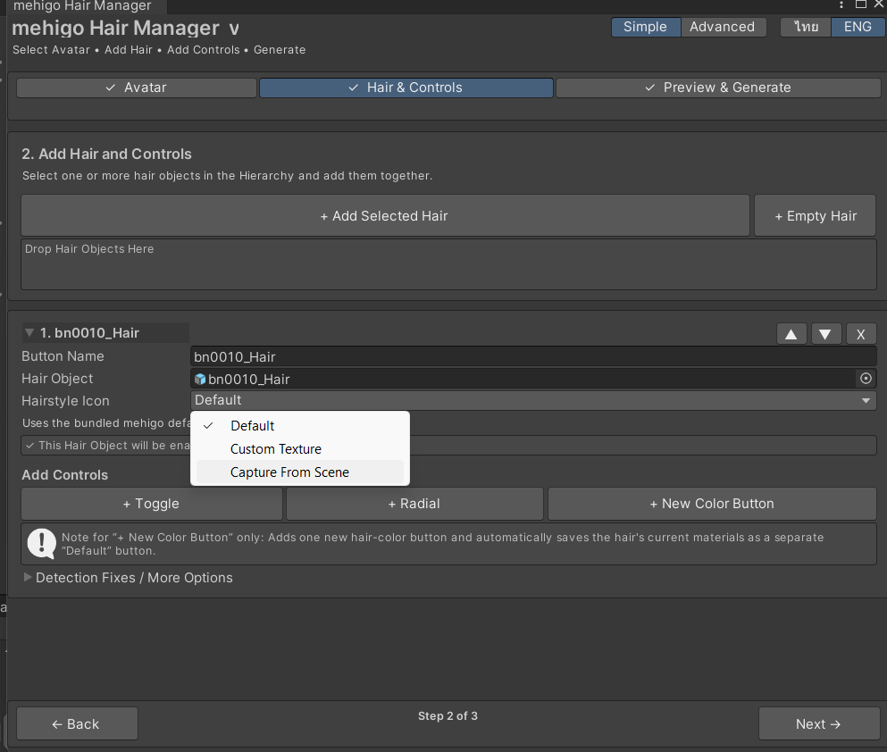

### Default

ใช้ไอคอนทรงผมมาตรฐานที่รวมมากับ mehigo Hair Manager

### Custom Texture

เลือก Texture2D จาก Project เป็นไอคอนของทรงผม แนะนำภาพสี่เหลี่ยมจัตุรัสและเปิด Alpha หากต้องการพื้นหลังโปร่งใส

### Capture From Scene

ใช้มุมกล้องปัจจุบันของ Scene View สร้างภาพไอคอนขนาด 256 × 256:

1. จัดมุม Avatar ใน Scene View
2. เลือก **Capture From Scene**
3. กด **Preview / Capture**
4. กด **Refresh Preview** เมื่อต้องการอัปเดตมุม
5. กด **Capture & Use** เพื่อบันทึกและใช้ภาพ

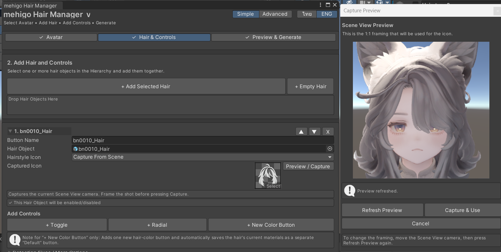

ภาพ Capture จะถูกบันทึกใน Output Folder ของ Avatar นี้ จึงไม่เขียนทับไอคอนของ Avatar อื่น

## 6. เพิ่มปุ่ม Toggle และ Radial

### Toggle — ปุ่มเปิด/ปิด

กด **+ Toggle** แล้วเลือก BlendShape จากรายการ ระบบจะค้นหา Renderer และ BlendShape ใต้ Hair Object ให้เอง

Toggle เหมาะกับค่าที่มีสองสถานะ เช่น:

- เปิด/ปิดหูแมว
- เปิด/ปิดริบบิ้น
- สลับผมสั้น/ยาวแบบทันที

### Radial — ปุ่มปรับระดับ

กด **+ Radial** แล้วเลือก BlendShape จากรายการเดียวกัน Radial เหมาะกับการปรับค่าแบบต่อเนื่องตั้งแต่ 0–100

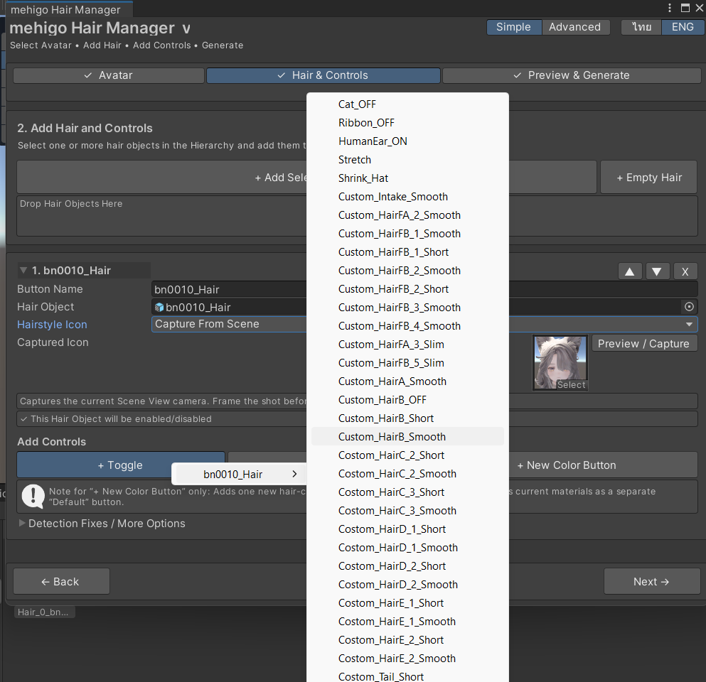

หลังเลือกแล้ว ผู้ใช้สามารถแก้ชื่อปุ่มได้ รายการจะแสดงชนิด **Toggle** หรือ **Radial** พร้อมชื่อ Renderer และ BlendShape ต้นทาง

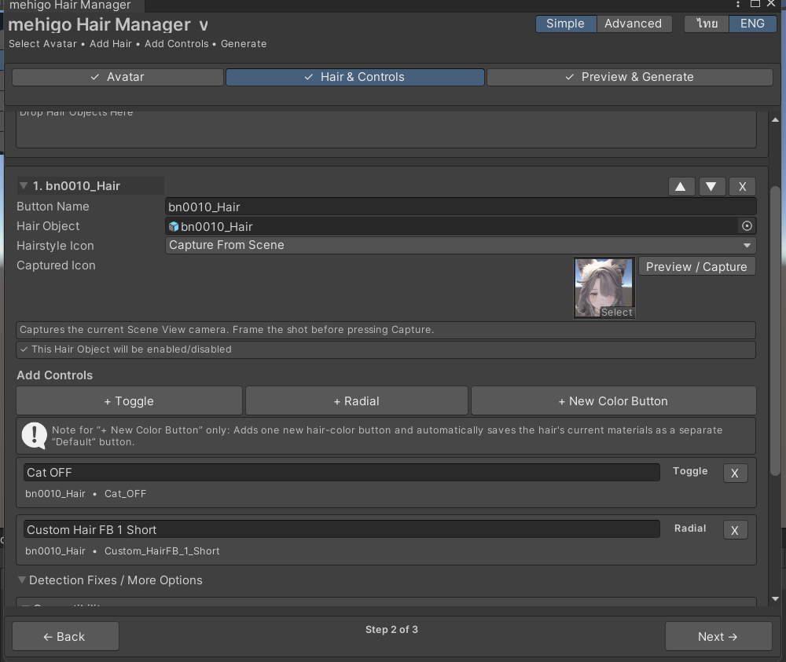

ปุ่ม `X` ด้านขวาของแต่ละรายการลบเฉพาะปุ่มนั้นออกจาก Setup

## 7. เพิ่ม Hair Material Preset

กด **+ Material Preset** เพื่อเพิ่มปุ่มสำหรับสลับชุด Material ที่มีอยู่ให้กับทรงผม

> Material Preset ไม่ได้สร้าง Material ใหม่หรือแก้ค่าสีใน Shader แต่จะเปลี่ยน Material Asset ที่กำหนดให้ Renderer/Slot ระบบจะบันทึก Material ที่ใช้อยู่ขณะนั้นเป็นปุ่ม **Default** ให้อัตโนมัติ

ในส่วน **Material Presets**:

1. เปลี่ยนชื่อ `Material 1` เป็นชื่อปุ่มที่ต้องการ เช่น `Pink`, `White` หรือ `Black`
2. เปลี่ยน Material เฉพาะ Renderer/Slot ที่ต้องการ
3. หากทรงผมใช้หลาย Material Slot ระบบจะแสดงทุก Slot ที่ตรวจพบ
4. กด `X` เพื่อลบ Material Preset นั้น

ค่า Default จะไม่แสดงเป็นช่องแก้ไขใน Hair Card เพราะระบบเก็บจาก Material เดิมให้อัตโนมัติ แต่จะปรากฏเป็นปุ่มแยกใน Hair Materials submenu ตอน Preview และในเมนูที่ Generate จริง

## 8. ใช้หลายทรงผม

สามารถเพิ่ม Hair Card ได้หลายรายการ การเปิด Card หนึ่งใบจะพับ Card อื่นเพื่อให้หน้าจอไม่รก ใช้ปุ่ม `▲` และ `▼` กำหนดลำดับที่จะแสดงในเมนู

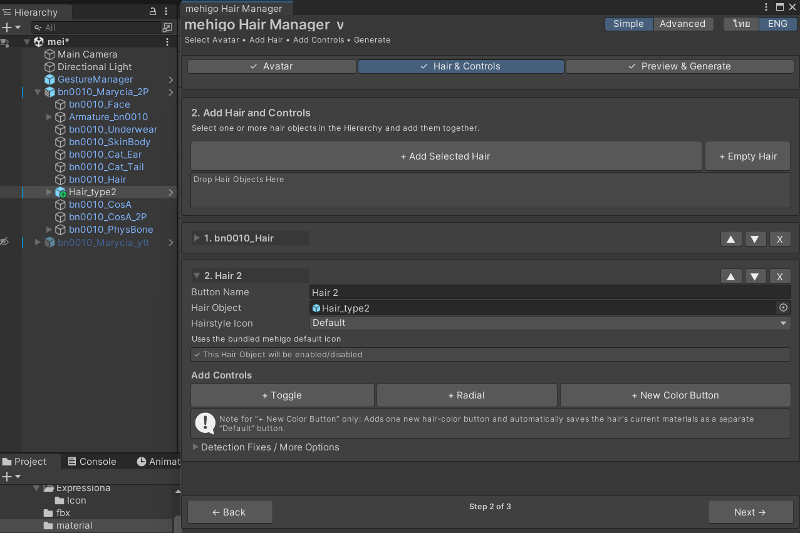

แต่ละทรงผมมีไอคอน, Toggle, Radial และ Material Preset เป็นของตัวเอง

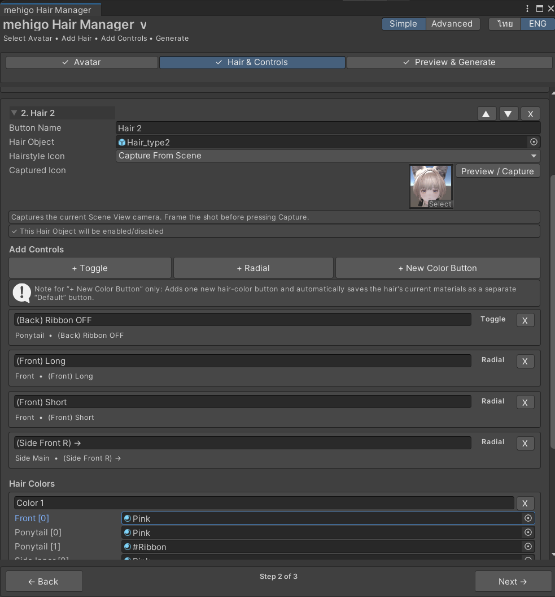

### Detection Fixes / More Options

ปกติไม่จำเป็นต้องเปิดส่วนนี้ ใช้เฉพาะเมื่อระบบตรวจ Wrapper หรือการเปิด–ปิดทรงผมไม่ตรงกับแพ็กเกจผมที่ใช้ ภายในสามารถ:

- เลือกให้ควบคุม Hair Object โดยตรง
- เลือก Existing Wrapper
- ให้ระบบอื่นควบคุมการแสดงทรงผม
- เพิ่มวัตถุที่ต้องเปิดพร้อมทรงผม เช่น เครื่องประดับหรือหู

## 9. หน้า Preview & Generate

เมื่อข้อมูลครบ กด **Next** ไปหน้า 3 ระบบจะแสดงจำนวนทรงผม, ปุ่มปรับแต่ง และ Material Preset ทั้งหมด

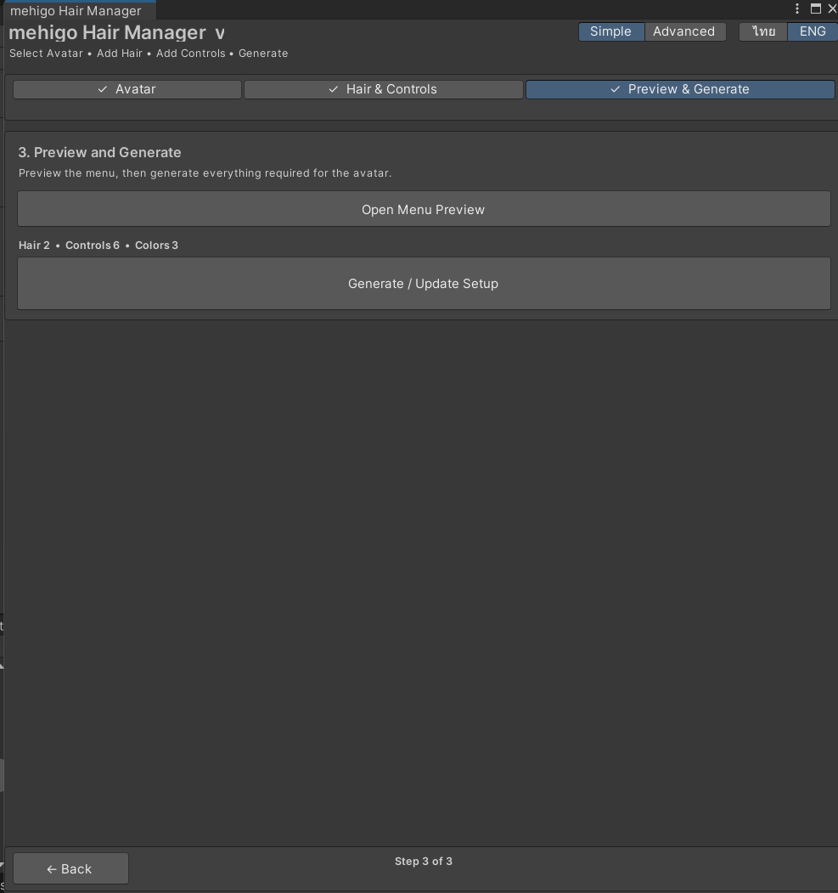

หากข้อมูลไม่ครบ ปุ่ม Generate จะถูกปิดและมีข้อความบอกจุดที่ต้องแก้ เมื่อกดปุ่มแก้ไข ระบบจะกลับไปเปิด Hair Card ที่มีปัญหาให้

## 10. ตรวจ Menu Preview

กด **Open Menu Preview** เพื่อดูโครงสร้างเมนูจากค่าปัจจุบันโดยไม่สร้างหรือแก้ Asset

### เมนูหลัก

หน้าแรกแสดงทรงผมทั้งหมดตามลำดับ Hair Card

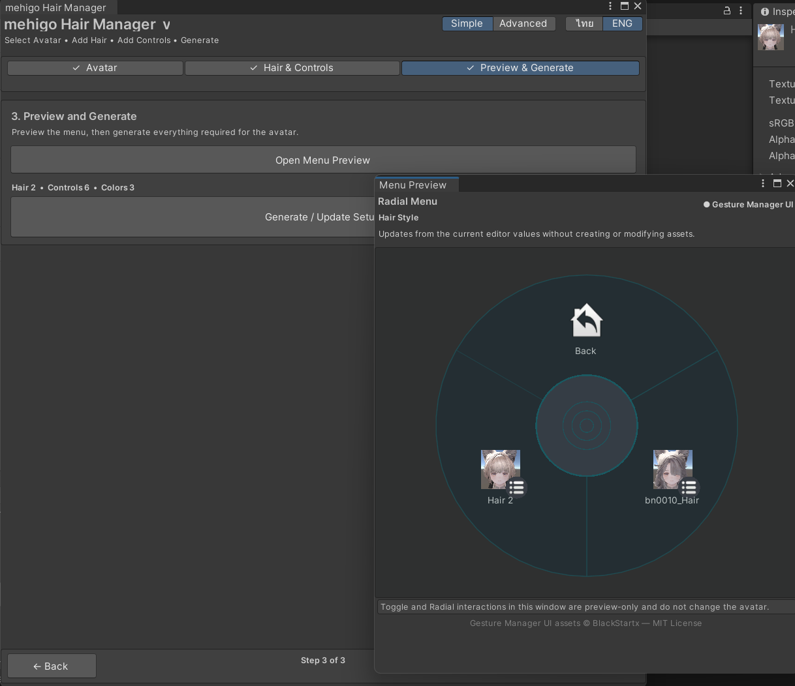

### เมนูภายในทรงผม

เมื่อเลือกทรงผม จะเห็นปุ่มใช้ทรงผม, Toggle, Radial และ Hair Materials submenu

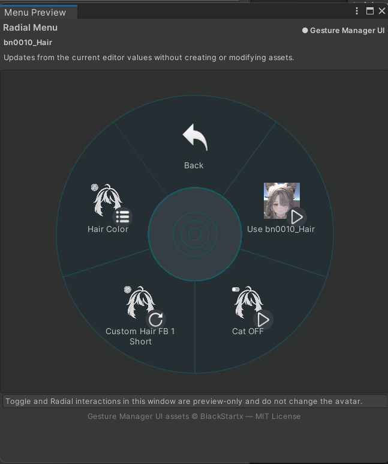

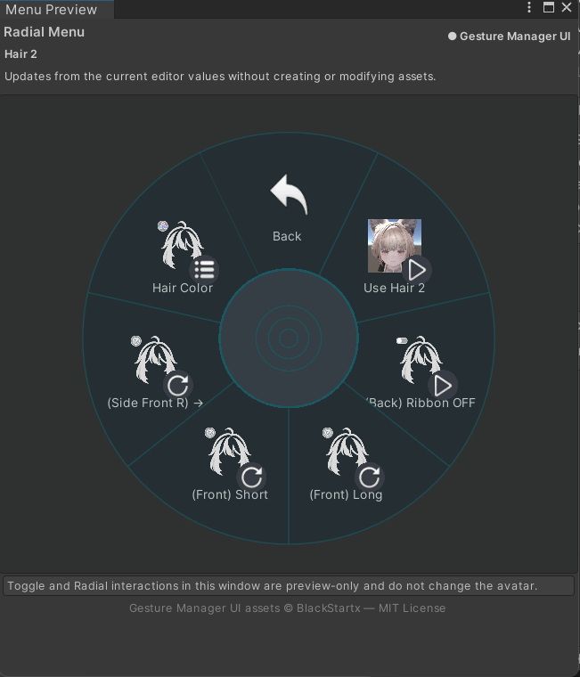

- กด Toggle เพื่อจำลองสถานะเปิด/ปิด
- กด Radial เพื่อเปิด Slider ทดลองค่า
- การกดใน Preview เป็นเพียงการจำลองและไม่เปลี่ยน Avatar ใน Scene
- หากมีปุ่มเกินหนึ่งหน้า Preview จะแสดงปุ่มเปลี่ยนหน้าให้อัตโนมัติ

### Hair Materials submenu

Hair Materials submenu แสดง **Default** และ Material Preset ทั้งหมด เมื่อกดปุ่ม ระบบจะสลับ Material Asset ที่กำหนดไว้ ไม่ได้สร้างสีใหม่ ทุก Preset ใช้ไอคอน Material Preset มาตรฐานเดียวกัน

## 11. Generate หรือ Update Setup

เมื่อตรวจ Preview แล้ว กด **Generate / Update Setup** ระบบจะ:

1. ตรวจความถูกต้องและ Conflict
2. สร้างหรืออัปเดต Animator Controller และ Animation Clips
3. สร้าง Expression Menu และ Parameters
4. สร้าง GameObject `mehigo Hair Selector` ใต้ Avatar
5. ใส่ Modular Avatar Merge Animator, Parameters และ Menu Installer
6. บันทึก Config สำหรับโหลดกลับมาแก้ไขภายหลัง

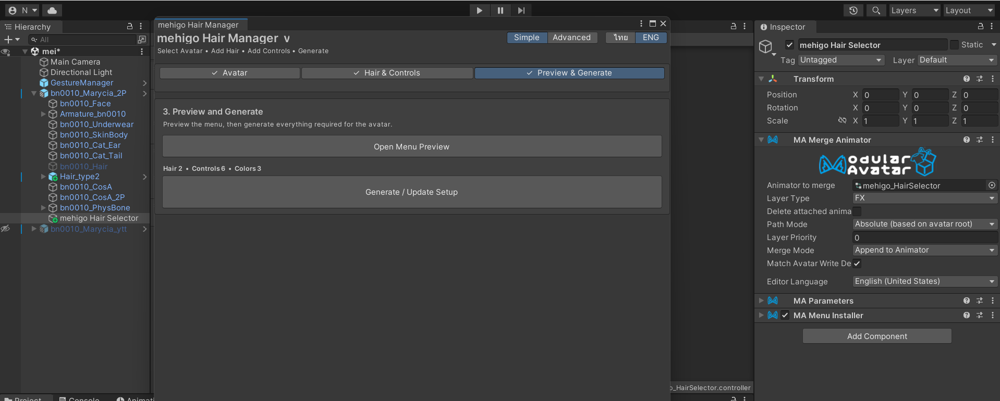

ไฟล์ที่ Generate จะอยู่ในโฟลเดอร์ `Avatar_<id>` แยกตาม Avatar การ Generate ซ้ำบน Avatar เดิมจะอัปเดตไฟล์ของ Avatar นั้น ส่วน Avatar อีกตัวจะได้รับโฟลเดอร์แยกและไม่เขียนทับกัน

หากตรวจพบ Conflict ระบบจะหยุดก่อนสร้างและแสดงปุ่มเปิดหน้าตรวจสอบใน Advanced Mode

## 12. แก้ไข Setup ภายหลัง

1. เปิด Hair Manager
2. เลือก Avatar เดิมในหน้า Avatar
3. กด **Load Existing Setup for This Avatar**
4. แก้ Hair Card, ปุ่มหรือสีที่ต้องการ
5. ตรวจ Menu Preview
6. กด **Generate / Update Setup** อีกครั้ง

อย่าแก้ Generated Animator, Animation หรือ Menu โดยตรง เพราะการ Update ครั้งถัดไปอาจเขียนทับการแก้ไขนั้น

## Checklist ก่อน Upload Avatar

- ทรงผมทุกชุดเปิด–ปิดถูกต้อง
- Toggle และ Radial ควบคุมเฉพาะ BlendShape ของทรงผมที่ตั้งไว้
- ปุ่ม Default คืน Material เดิมได้
- ทุก Material Preset ใช้ Material Asset และ Slot ถูกต้อง
- Menu Preview มีปุ่มครบและลำดับถูกต้อง
- ทดสอบ Avatar ใน Play Mode หรือเครื่องมือทดสอบก่อน Build/Upload
