# คู่มือการใช้งาน mehigo Hair Manager 1.2.1

[คู่มือ Simple Mode 1.2.0](SIMPLE_MODE_GUIDE_TH.md) | [ภาษาไทยฉบับเต็ม](USER_GUIDE_TH.md) | [English](USER_GUIDE_EN.md) | [หน้าโครงการ](../README.md)

> สำหรับ Unity 2022.3 และ mehigo Hair Manager 1.2.1

mehigo Hair Manager เป็น Community-made Unity Editor Automation Tool ที่สร้างมาเพื่อใช้กับ [Modular Avatar](https://modular-avatar.nadena.dev/) ระบบจะสร้าง Animator Controller และ Layer, Animation Clips, Expression Menu, Parameters, Material Swap controls, Icon, Config และ Component ของ Modular Avatar ที่จำเป็น โดย Modular Avatar เป็น Core Dependency และทำ non-destructive integration ตอน Build

> โปรเจกต์นี้ไม่ใช่โปรเจกต์ทางการของ Modular Avatar และไม่มีความเกี่ยวข้องหรือได้รับการรับรองจาก bd_ หรือผู้พัฒนา Modular Avatar

## มีอะไรใหม่ในเวอร์ชัน 1.2.1

- เพิ่มภาษาญี่ปุ่นใน Editor รวมถึง Menu Preview และ Scene View Capture
- เพิ่มคู่มือ Simple Mode ภาษาญี่ปุ่นโดยใช้ศัพท์ตาม Unity ภาษาญี่ปุ่น

## มีอะไรใหม่ในเวอร์ชัน 1.2.0

- เพิ่ม **Simple Mode** เป็นหน้าเริ่มต้น โดยแยกเป็น Avatar → Hair & Controls → Preview & Generate
- เพิ่มหลายทรงผมจาก Selection หรือลาก GameObject มาวางได้
- เพิ่มปุ่ม Toggle และ Radial จากรายการ BlendShape โดยไม่ต้องเลือก Renderer เอง
- เพิ่ม Hair Material Preset พร้อม Scan Default Material อัตโนมัติ โดยระบบสลับ Material Asset ที่มีอยู่ ไม่ได้สร้าง Material หรือแก้สีให้
- เก็บหน้าจอและตัวเลือกเดิมทั้งหมดไว้ใน **Advanced Mode**

## สิ่งที่เพิ่มไว้ตั้งแต่เวอร์ชัน 1.1.0

- ภาษาเริ่มต้นของหน้าต่าง Editor เปลี่ยนเป็น English; สลับได้ด้วยปุ่ม **ไทย / ENG**
- เหลือ 3 แท็บ: **Avatar Info**, **Hair Styles** และ **Generate**
- ย้าย **Conflict Scanner** มาไว้ในหน้า Generate
- เพิ่ม **Real-Time Menu Preview** แบบ Radial สำหรับทรงผม, BlendShape และ Material Preset
- ซ่อนแท็บ Performance และโหมดทดลองชั่วคราว โดยใช้ Standard Animator ที่เสถียรเสมอ
- แยกไฟล์ที่ Generate ลงโฟลเดอร์ `Avatar_<id>` ของอวาตาร์แต่ละ instance ป้องกันการเขียนทับกัน
- รองรับ VRChat Avatars SDK ช่วง `>=3.10.4 <3.11.0`

## ความต้องการ

- Unity 2022.3
- โปรเจกต์ VRChat Avatars
- VRChat Avatars SDK `>=3.10.4 <3.11.0`
- Modular Avatar `>=1.14.0 <2.0.0-a`

ไม่บังคับ: Avatar Optimizer (AAO) สำหรับ Optimize ตอน Build และ [Gesture Manager](https://github.com/BlackStartx/VRC-Gesture-Manager) สำหรับรูปแบบ Preview ที่คุ้นเคย เมื่อติดตั้งไว้ Menu Preview จะโหลด UI assets จากแพ็กเกจ Gesture Manager ของผู้ใช้ โดยไม่ได้ bundle มากับ mehigo และไม่มีผลต่อ Asset ที่ Generate หากไม่มีจะใช้หน้าตาสำรองในตัว Gesture Manager UI assets © 2019–2023 BlackStartx — [MIT License](https://github.com/BlackStartx/VRC-Gesture-Manager/blob/master/LICENSE.md)

> รุ่น 1.1.0 ทดสอบกับ VRChat SDK 3.10.4 ควรทดสอบอวาตาร์ใหม่หลังเปลี่ยน SDK หรือแพ็กเกจทุกครั้ง

## 1. ติดตั้ง

### ติดตั้งผ่าน VCC (แนะนำ)

1. เพิ่ม Modular Avatar repository: `https://vpm.nadena.dev/vpm.json`
2. เพิ่ม mehigo repository: `https://mehigosleep.github.io/mehigo-hair-manager/vpm.json`
3. เปิด **Manage Project** ของโปรเจกต์ แล้วติดตั้ง Modular Avatar และ mehigo Hair Manager
4. เปิด Unity และรอให้ Compile เสร็จ

### ติดตั้งด้วยตนเอง

1. ติดตั้ง VRChat Avatars SDK และ Modular Avatar
2. คัดลอกโฟลเดอร์ `Editor` ของแพ็กเกจทั้งชุด รวม `MehigoHairManager.cs` และ `Icons` ไปไว้ใต้ `Assets`
3. อย่าเก็บสคริปต์ mehigo Hair Generator รุ่นเก่าที่ประกาศ class เดียวกันไว้พร้อมกัน

## 2. เตรียมอวาตาร์

1. สำรองโปรเจกต์หรือ Commit ก่อนเริ่ม
2. วางอวาตาร์และทรงผมทุกชุดใน Scene
3. ตรวจให้มี **VRC Avatar Descriptor** และจัดตำแหน่งทรงผมเรียบร้อย
4. ระบุวัตถุที่ต้องเปิด–ปิดพร้อมทรงผม เช่น หู เครื่องประดับ หรือวัตถุครอบ

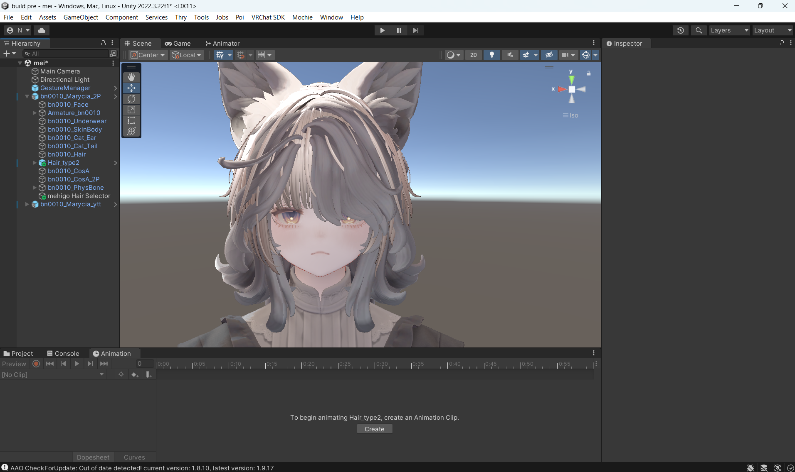

## 3. เปิด Hair Manager

เลือก **Tools > mehigo > Hair Manager**

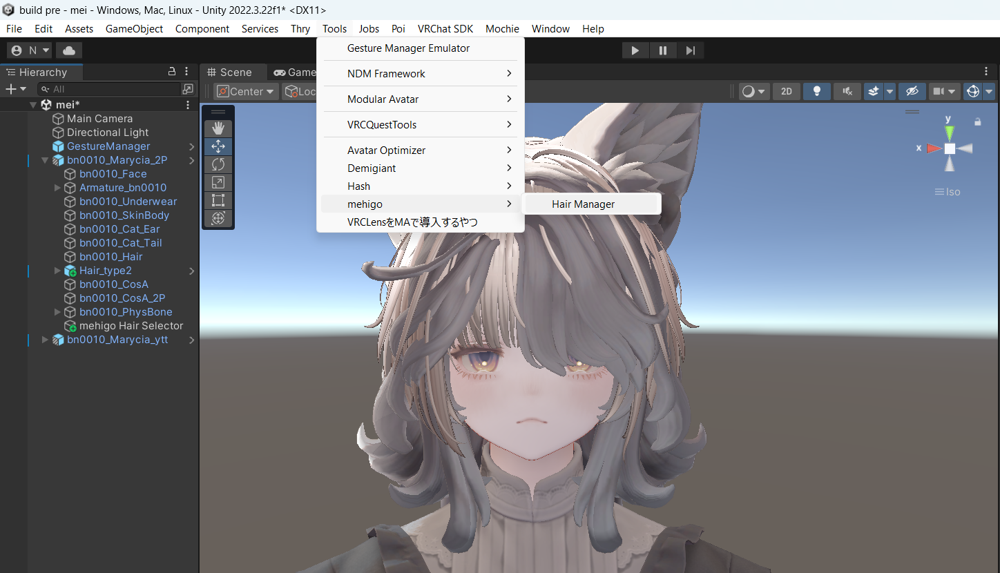

ปุ่มมุมขวาบนใช้สลับ **Simple / Advanced** และภาษา **ไทย / ENG** ได้ตลอดเวลา

## เริ่มต้นด้วย Simple Mode

Simple Mode เป็นหน้าหลักสำหรับงานทั่วไป:

1. หน้า **Avatar**: เลือก Avatar ระบบจะตรวจหา Avatar Descriptor และ Output Folder อัตโนมัติ
2. หน้า **Hair & Controls**: เลือก Hair Object หลายชิ้นใน Hierarchy แล้วกด **เพิ่มทรงผมที่เลือก** หรือลากมาวาง
3. ใช้ **+ เปิด / ปิด**, **+ ปรับระดับ** หรือ **+ Material Preset** ใน Hair Card โดยเมื่อเพิ่ม Preset ระบบจะบันทึก Material ที่ทรงผมใช้อยู่เป็นปุ่ม **ค่าเริ่มต้น (Default)** ให้อัตโนมัติ
4. หน้า **Preview & Generate**: กด **เปิด Menu Preview** เพื่อตรวจโครงสร้างเมนู
5. กด **สร้าง / อัปเดต Setup**

ระบบจะตั้งชื่อปุ่มจากชื่อ Object/BlendShape, รักษา Animator เดิม, ตรวจ Hair Root/Wrapper และ Scan Default Material ให้โดยอัตโนมัติ หากต้องแก้ Parameter, Save Folder, Activation Mode หรือรายละเอียด BlendShape ให้สลับเป็น **Advanced**

ช่อง **ไอคอนทรงผม** ใน Simple Mode เลือกได้สามแบบ: ใช้ Default Icon ของ mehigo, เลือก Texture จาก Project หรือ Capture จาก Scene View ระบบมี Default Icon แยกสำหรับเมนูหลัก, ทรงผม, Toggle BlendShape, Radial BlendShape และ Material Preset

หัวข้อตั้งแต่ข้อ 4 เป็นต้นไปอธิบายหน้าจอ Advanced Mode

## 4. ตั้งค่า Avatar Info

1. เลือก GameObject อวาตาร์หรือ Prefab ในช่อง **Prefab / Avatar**
2. ระบบจะตรวจหา **Avatar Descriptor** อัตโนมัติ
3. ตั้ง **Root Menu Name** ตามชื่อเมนูที่ต้องการ เช่น `Hair Style`
4. เปิด **Save Selected Hair** หากต้องการจำทรงผมที่เลือก
5. ถ้ามี Setup เดิม กด **Load Existing Setup** ก่อนแก้ไข

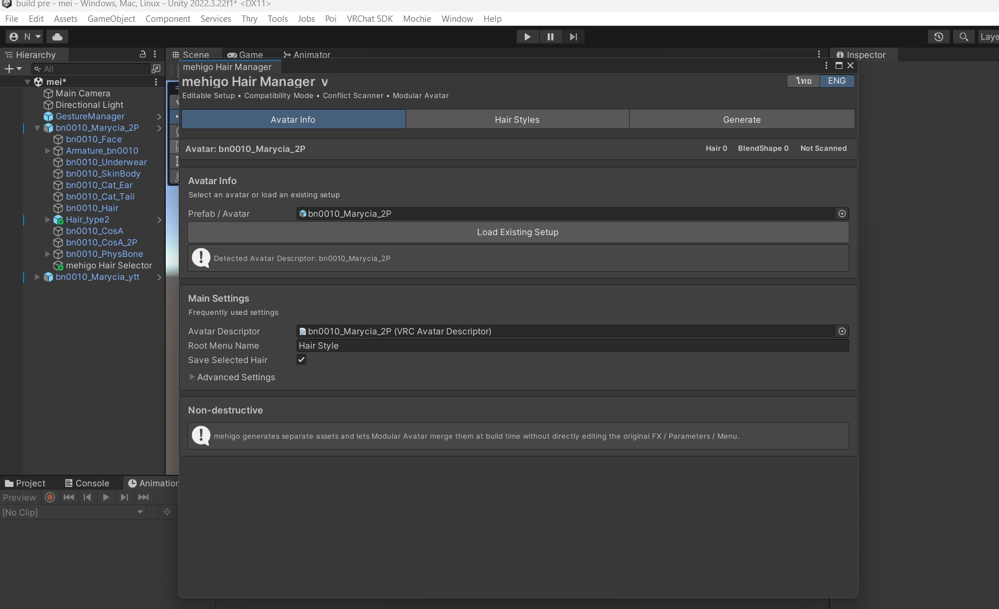

ใน **Advanced Settings** สามารถเปลี่ยน Save Folder ได้ โฟลเดอร์นี้เป็นฐานร่วม; รุ่น 1.1.0 จะสร้าง `Avatar_<id>` แยกให้แต่ละ avatar instance อัตโนมัติ แม้จะเป็นสำเนาจาก Prefab เดียวกันก็ตาม

## 5. เพิ่มทรงผม

เปิดแท็บ **Hair Styles** แล้วเลือกวิธีใดวิธีหนึ่ง:

- เลือกวัตถุทรงผมใน Hierarchy แล้วกด **Add Selected**
- กด **+ Add Hair** แล้วลากวัตถุลงช่อง **Hair Object**

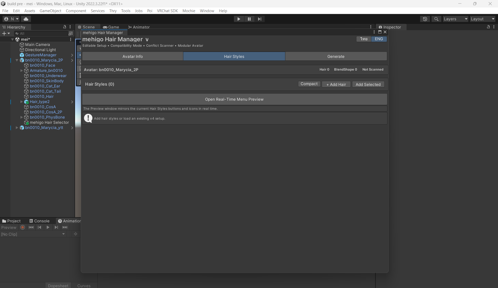

ตั้งค่าหลักของแต่ละรายการ:

- **Menu Button Name**: ชื่อที่แสดงในเมนู VRChat
- **Button Icon**: ไอคอนของปุ่ม; Default ใช้ไอคอนที่รวมมากับ mehigo
- **Hair Object**: รากของทรงผมชุดนั้น
- ปุ่มลูกศร: เปลี่ยนลำดับเมนู
- ปุ่ม `X`: ลบรายการออกจาก Setup โดยไม่ลบ GameObject ต้นฉบับ

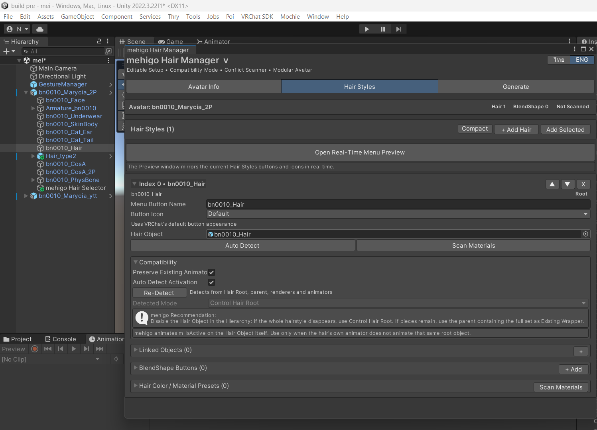

### Compatibility และการตรวจจับการเปิด–ปิด

กด **Auto Detect** หรือ **Re-Detect** เพื่อให้เครื่องมือตรวจวัตถุ, Renderer และ Animator ใต้ Hair Root

- **Preserve Existing Animator**: รักษาพฤติกรรม Animator เดิมของทรงผม
- **Auto Detect Activation**: ให้ระบบเลือกวิธีเปิด–ปิดที่เหมาะสม
- **Control Hair Root**: ใช้เมื่อปิด Hair Object แล้วทรงผมหายครบทั้งชุด
- **Existing Wrapper**: ใช้ parent/wrapper ที่ครอบทั้งชุด เมื่อปิดรากแล้วมีบางชิ้นยังเหลือ

อ่านข้อความ Recommendation ใต้ Detected Mode และทดสอบเปิด–ปิด GameObject ใน Hierarchy ก่อน Generate

## 6. Linked Objects

ใช้กับวัตถุที่ต้องเปิด–ปิดพร้อมทรงผมแต่ไม่ได้อยู่ใต้ Hair Root เช่น หูสัตว์ โบ หรือเครื่องประดับ

1. เปิด **Linked Objects**
2. กด `+`
3. ลาก GameObject ที่ต้องการลงช่อง Object

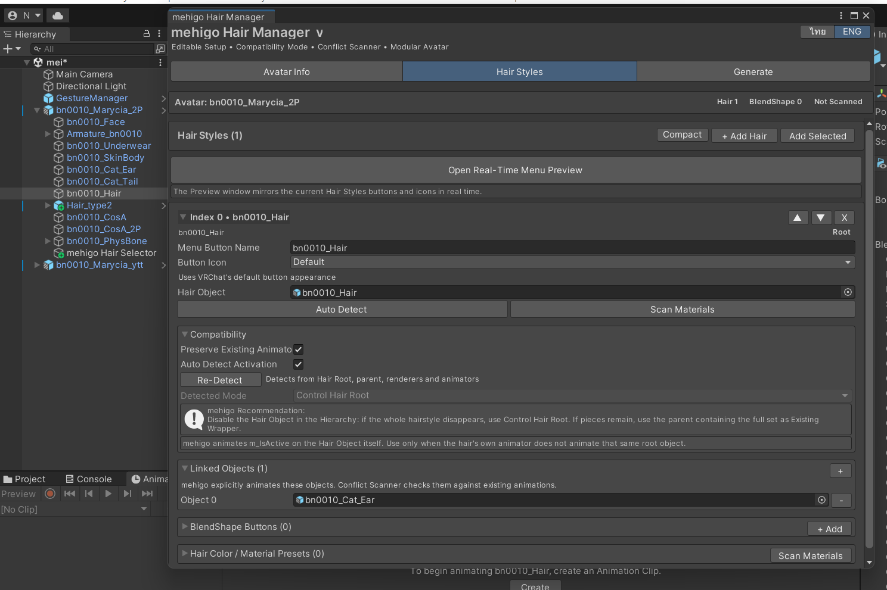

Conflict Scanner จะตรวจ property ของ Linked Objects เหล่านี้ร่วมด้วย หลีกเลี่ยงการใส่วัตถุเดียวกันในหลายรายการหากต้องการสถานะต่างกัน

## 7. BlendShape Buttons

1. เปิด **BlendShape Buttons** แล้วกด **+ Add**
2. ตั้ง **Button Name**
3. เลือก **Control Type**
4. ระบุ Skinned Mesh Renderer และ BlendShape

- **Toggle**: สลับระหว่าง 0 กับ **ON Value**
- **Radial Puppet**: สร้าง Float parameter ช่วง 0–1 และแมปไปถึง **Radial Max Value**
- **Saved**: จำค่าคอนโทรลไว้ระหว่างการโหลดอวาตาร์

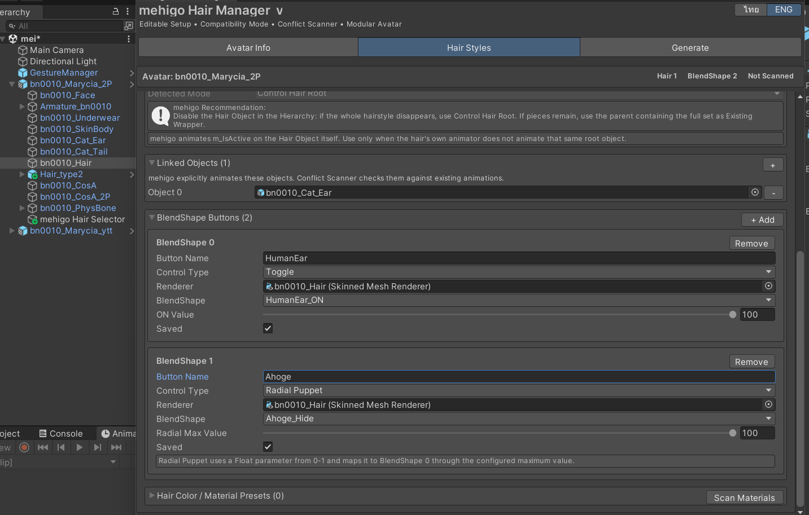

รุ่น 1.1.0 สร้าง BlendShape ด้วย Standard Animator เท่านั้น โหมด Direct BlendTree แบบทดลองถูกซ่อนเพื่อความเสถียร

## 8. Hair Material Presets

Material Preset จะเปลี่ยน Material Asset ที่กำหนดให้ Renderer/Slot เท่านั้น ไม่ได้สร้าง Material ใหม่หรือแก้ค่าสีใน Shader ผู้ใช้ต้องเตรียม Material แต่ละแบบไว้ก่อนแล้วจึงนำมาเลือกใน mehigo Hair Manager

1. กด **Scan Materials**
2. กด **Create Default Material Preset** เพื่อบันทึก material ทุก slot ใต้ Hair Root
3. กด **+ Add Material Preset**
4. ตั้งชื่อ/ไอคอน และแทนเฉพาะ material slot ที่ต้องการเปลี่ยน

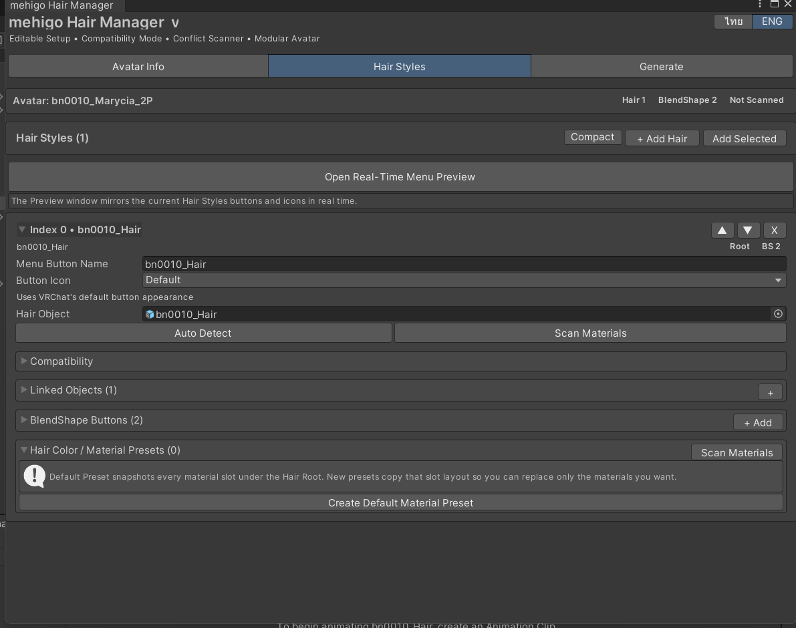

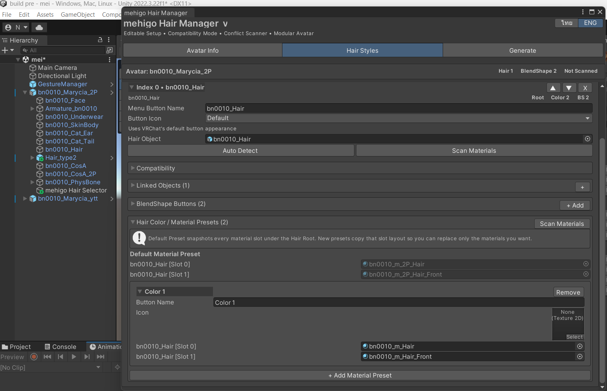

อย่าเปลี่ยนลำดับ Renderer หรือ material slot หลังตั้งค่า หากแก้โครงสร้างทรงผมให้ Scan Materials และตรวจ Preset ใหม่

## 9. เพิ่มหลายทรงผม

ทำขั้นตอน Hair Object, Compatibility, Linked Objects, BlendShape และ Material Preset ซ้ำกับแต่ละทรง ระบบแสดงจำนวน Hair และ BlendShape ที่แถบสถานะด้านบน

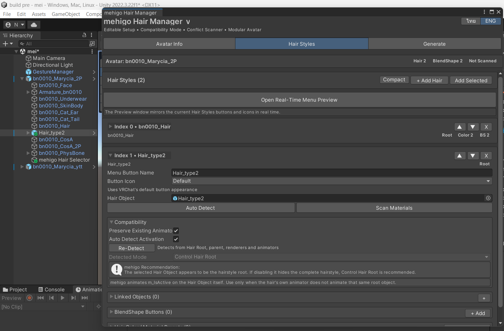

## 10. ตรวจเมนูด้วย Real-Time Preview

ในแท็บ **Hair Styles** กด **Open Real-Time Menu Preview** หน้าต่างจะแสดงโครงสร้างปัจจุบันโดยไม่สร้างหรือแก้ไข Asset

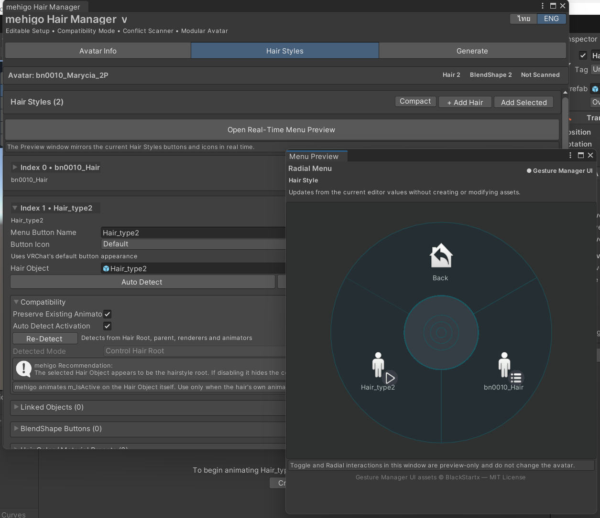

เลือกทรงผมเพื่อดู submenu ของ Material Preset และ BlendShape ป้ายเล็กบนไอคอนช่วยแยก Toggle, Radial และ submenu และใช้ **Back** เพื่อย้อนกลับ

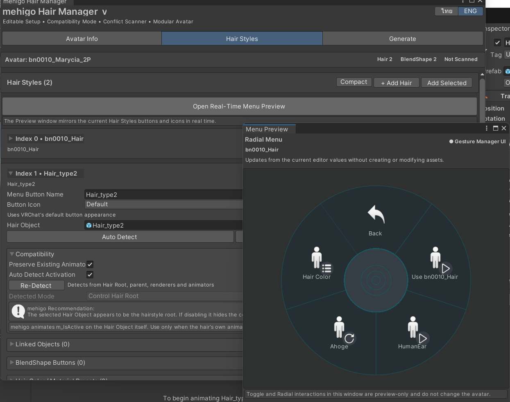

Preview เป็นการตรวจหน้าตาและโครงสร้างเท่านั้น การคลิกในหน้าต่างนี้ไม่เปลี่ยนค่าบนอวาตาร์ และเปิดได้จากหน้า Hair Styles เท่านั้น

## 11. สแกน Conflict และ Generate

เปิดแท็บ **Generate** แล้วตรวจส่วน **Preflight** ว่าเลือก Avatar และพบจำนวน Hair ถูกต้อง

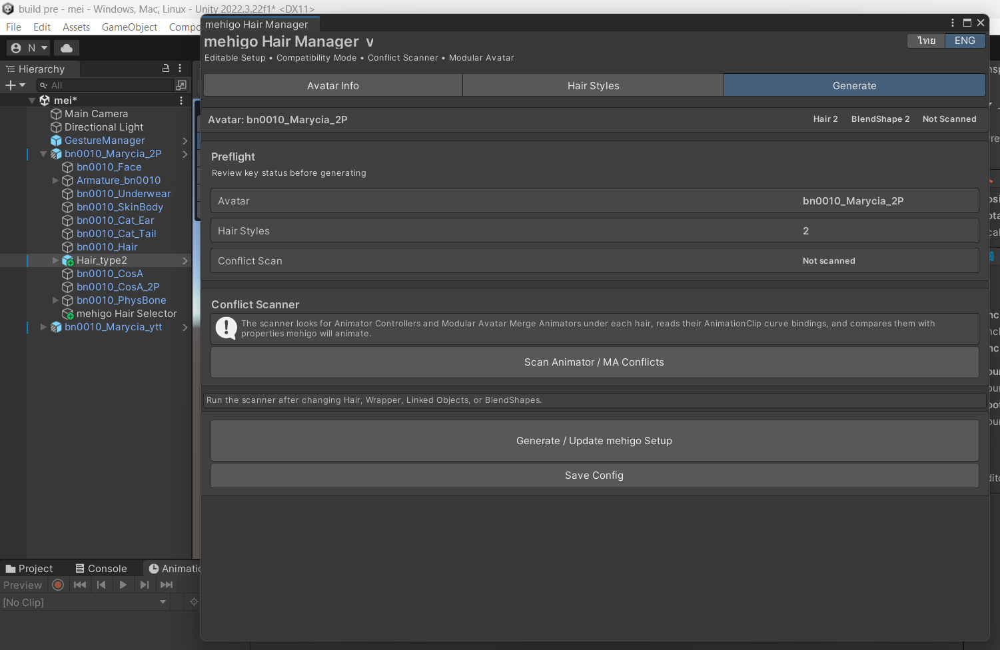

1. กด **Scan Animator / MA Conflicts** หลังเปลี่ยน Hair, Wrapper, Linked Objects หรือ BlendShape
2. หากพบ Conflict ให้ตรวจ Animator Controller หรือ Modular Avatar Merge Animator ที่อ้างถึง property เดียวกับที่ mehigo จะ Animate
3. เมื่อขึ้น **Passed** หรือเข้าใจ Warning ทั้งหมดแล้ว กด **Generate / Update mehigo Setup**
4. กด **Save Config** หากต้องการบันทึกการตั้งค่าปัจจุบัน

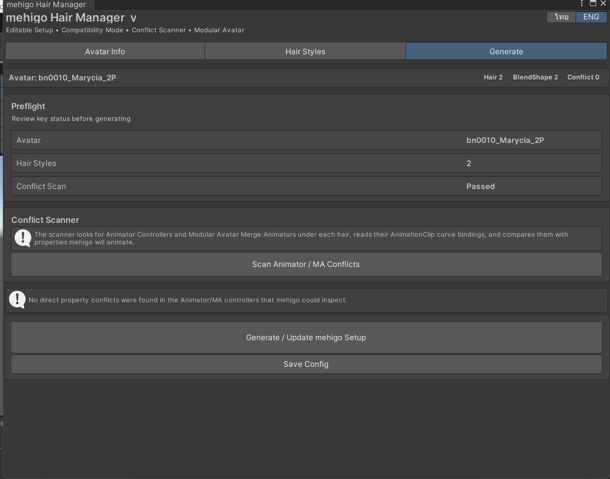

## 12. สิ่งที่ระบบสร้าง

mehigo Hair Manager จะสร้างหรืออัปเดต Animator Controller และ Layer, Animation Clips, Expression Menu, Parameters, Icon, Config และ Component ของ Modular Avatar ที่จำเป็น จากนั้น Modular Avatar จะใช้ Setup ที่สร้างขึ้นนี้ทำ non-destructive integration ตอน Build โดยไม่เขียนทับ Controller/Menu/Parameters ต้นฉบับโดยตรง

- Save Folder เป็นโฟลเดอร์ฐานร่วม
- Runtime assets อยู่ใน `Avatar_<id>` ของอวาตาร์แต่ละ instance
- การ Generate ซ้ำบนอวาตาร์เดิมจะ Update ไฟล์ของอวาตาร์นั้น
- Prefab asset ที่เปิดโดยตรงจะใช้ asset GUID เป็นตัวระบุ
- ไฟล์เก่าจากรุ่นก่อนที่อยู่ตรง Save Folder จะไม่ถูกลบอัตโนมัติ
- Controller เก่าชื่อ `mehigo_HairSelector_v4.controller` จะย้ายเป็น `mehigo_HairSelector.controller` โดยรักษา GUID และ reference

ควรแก้ Setup ผ่าน Hair Manager เพราะ Generate/Update ครั้งถัดไปอาจเขียนทับ Asset ที่แก้ด้วยมือ

## 13. แก้ Setup เดิม

1. เลือกอวาตาร์เดิมใน Avatar Info
2. กด **Load Existing Setup** หรือเลือก Component **mehigo Hair Selector** ที่สร้างไว้
3. แก้รายการและ Preview ใหม่
4. Scan Conflict แล้วกด Generate / Update

## 14. ตรวจสอบก่อนอัปโหลด

- ทดสอบปุ่มเลือกทุกทรงและปุ่มย้อนกลับ
- ตรวจว่าเลือกได้ทีละทรงตามต้องการ
- ทดสอบ Linked Objects, BlendShape Toggle/Radial และ Material Preset ทุกปุ่ม
- ทดสอบค่า Saved หลัง Reload Avatar
- ตรวจ FX/MA animation เดิมว่าไม่ถูกแย่ง property
- Build & Test ด้วย VRChat SDK ก่อน Upload จริง

## การแก้ปัญหา

### ไม่พบ Avatar Descriptor

เลือก GameObject รากที่มี VRC Avatar Descriptor หรือกำหนด Avatar Descriptor ใน Avatar Info เอง

### ปิดทรงผมแล้วบางชิ้นยังอยู่

กด Re-Detect และใช้ parent ที่ครอบทรงผมครบชุดเป็น Existing Wrapper รวมถึงตรวจ Linked Objects

### BlendShape หรือวัตถุถูก Animator อื่นควบคุม

รัน Conflict Scanner และแก้ Controller/Merge Animator ที่ Animate path/property เดียวกันก่อน Generate

### Preview ไม่มีหน้าตา Gesture Manager

Gesture Manager เป็นตัวเลือก ระบบยังใช้ Preview แบบ fallback ได้ และผลลัพธ์ที่ Generate ไม่เปลี่ยน

### อวาตาร์สองตัวเขียนทับ Asset กัน

รุ่น 1.1.0 จะแยก `Avatar_<id>` อัตโนมัติ ตรวจว่าอวาตาร์แต่ละ instance ยังมี identity เดิมและไม่ได้ย้ายไฟล์ generated ด้วยมือ

### ต้องการถอนการติดตั้ง

สำรองโปรเจกต์ก่อน ลบ Component/วัตถุ Setup ที่ mehigo สร้างและ Asset ใน `Avatar_<id>` ที่ยืนยันแล้วว่าไม่ใช้งาน จากนั้นถอนแพ็กเกจผ่าน VCC อย่าลบโฟลเดอร์ฐานทั้งหมดหากมีหลายอวาตาร์ใช้งานร่วมกัน
